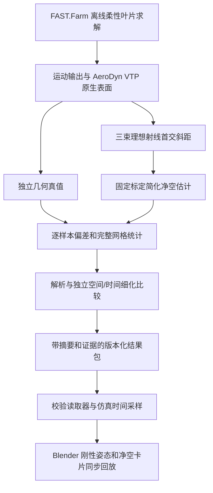

# WFRL Blender 前端

当前扩展版本 **0.2.3**，要求 Blender 5.2+。前端包括风场展示、云台相机、后端遥测和离线激光净空雷达回放。本版整理雷达卡片、工况说明和视角入口；继续使用 `normal-v1.1` / `close-v1.1`，没有重新计算物理结果。

安装包与摘要见[交付说明](../dist/README-lidar.md)；第一次操作见[用户使用手册](../docs/blender/用户使用手册.md)。修改扩展 Python 代码后需重新构建 ZIP，安装后重启 Blender；源码专用入口直接读取仓库代码。

## 1. 入口与界面

Mac 下载完整仓库后，双击 `scripts/blender/打开净空雷达演示.command`。也可从仓库根目录执行：

```sh
/Applications/Blender.app/Contents/MacOS/Blender --factory-startup --python scripts/blender/open_clearance_demo.py
```

入口读取 `dist/lidar-delivery.json`，打开随仓库提供的场景并加载正常工况，无需在线求解器。普通安装版在加载匹配风机场景后，通过 Camera 区“数据配置”指定两个包目录。

Camera 区顶部显示当前模式与来源，便于区分本地演示、后端运行和雷达离线回放。“净空与误差对比”优先显示真值、B2 估计、有符号偏差，以及播放/暂停、从头重播和回放进度。“测量详情与统计”和“数据配置”默认折叠；数据未就绪时自动显示配置与错误，修正目录后重新点击工况加载。

“正常测量”和“较小净空”切换结果包并自动进入测量区侧视；后者仍对应原 `close` 数据，不改变片段身份。常驻提示说明后端含叶片形变、画面为刚性示意。“测量区侧视”和“风场总览”只切相机，不改变数据模式或回放位置。回放进度是帧号；以卡片仿真秒数读取实际时刻。

## 2. 总体架构和模块



| 层 | 源码 | 职责 |
| --- | --- | --- |
| 离线运行 | [`run_physics.py`](../scripts/lidar/run_physics.py) | 复制原始算例、配置固定转速与风速、运行求解器、保存状态和日志 |
| 几何与公式 | [`physics.py`](../wfrl/lidar/physics.py) | 原生表面读取、射线首交、独立真值、固定标定估计、离散碰撞排除 |
| 后处理 | [`process_physics.py`](../scripts/lidar/process_physics.py) | 运动时间、掠塔网格、三束有效性与逐次测量 |
| 数值比较 | [`validate_physics.py`](../scripts/lidar/validate_physics.py)、[`sampling.py`](../wfrl/lidar/sampling.py) | 解析检查、展向细化、时间细化及含漏测的完整网格比较 |
| 正式发布 | [`publish_physics.py`](../scripts/lidar/publish_physics.py)、[`evidence.py`](../wfrl/lidar/evidence.py) | 验证运行链、证据合同与摘要，生成新包 |
| 播放内核 | [`replay.py`](../wfrl/lidar/replay.py) | 严格加载、确定性时间采样、保留时限、累计统计与滞回 |
| Blender 接入 | [`clearance_replay.py`](wfrl_blender/clearance_replay.py) | 场景和机型校验、时间轴映射、运动更新、加载/卸载恢复 |
| 视觉与操作 | [`clearance_visual.py`](wfrl_blender/clearance_visual.py)、[`panels/clearance.py`](wfrl_blender/panels/clearance.py)、[`cameras.py`](wfrl_blender/cameras.py) | 雷达与光束示意、数据卡片、工况操作和观察相机 |
| 打包 | [`build_extension.py`](../scripts/blender/build_extension.py) | 将标准库读取器与证据校验模块一起放入扩展 `_vendor/lidar` |

前端不读取原始 VTP，也不在 Blender 内重新求解净空。计算端使用 Python 与 NumPy；安装包回放模块只依赖标准库，不要求安装 FAST.Farm。

## 3. 测距、估计和独立真值

### 3.1 物理输入与标定

两个工况均为单机 NREL 5 MW、固定 9 rpm、0° 变桨、无策略 checkpoint；启用叶片柔性，塔筒和平台刚性。正常/较小净空分别为预先选定的 8/12 m/s 有剪切稳态风。运行 36 秒，剔除 0–18 秒启动段，完整保留 18–36 秒，不按误差挑片段。

FAST 全局坐标为 x 下风、y 横风、z 向上。雷达原点 `O=(-2,0,87.6) m`；B1/B2/B3 从竖直向下朝负 x 偏转 `6.45°/8.5°/10.54°`，单位方向为 `d=(-sinθ,0,-cosθ)`。固定理想有效斜距范围为 5–100 m。

### 3.2 测距与简化估计分支

对求解器同一时刻的三片叶片原生三角面进行双面 Möller–Trumbore 射线求交，同时比较刚性圆锥塔筒和地面；取射线 `O+L·d` 的最近正向交点。仅当首交属于当前预期叶片且距离在标定范围内，才是有效测量。遮挡、无命中和超量程保留无效原因。

每束采用同一公开简化公式：

```text
C_est = L · sin(θ) + Y_lidar − R_TIP
Y_lidar = 2 m
R_TIP = 2.67 m（名义叶尖高度 27.2 m 的固定塔半径标定）
```

`L` 是理想首交斜距，`θ` 是相对向下竖直的角度；角度在代码中转弧度后计算。`Y_lidar` 表示朝叶轮方向的主轴水平安装偏距。它不等同于全局 y 坐标；原手册图 2-5 与图 3-26 的 X/Y 命名不同，本实现按物理偏距映射。依据为 MolasCL V3.0 第 3.5.3 节、图 3-26 和图 2-5，原件核验记录见[雷达说明](../docs/blender/激光净空雷达使用说明.md)。

估计器只接收斜距、有效标志和固定标定，不接收实时叶尖位置、形变或真值。三束均存档，但卡片与主统计只使用 B2；B2 无效时不切换其他光束，不用真值填补。

### 3.3 独立真值分支与偏差

最外端 AeroDyn 翼型截面周界坐标的算术均值为叶尖参考点 `P=(x,y,z)`。从原生变形表面独立提取该点，计算它到同高度刚性塔筒圆截面壁的有符号径向净空：

```text
r(z) = 3 + (1.935 − 3) · z / 87.6，0 ≤ z ≤ 87.6
ρ = sqrt(x² + y²)
C_true = ρ − r(z)
Q = (x·r/ρ, y·r/ρ, z)（ρ > 0 时的塔壁参考点）
e = C_est − C_true
```

这两条分支共享同一仿真时刻，计算方式独立。真值不经简化测距公式产生；它是指定叶尖参考点的同高度塔壁距离，不是整片叶片表面的全局最小距离。正偏差表示估计高于真值。B2 误差同时包含直叶片假设、命中截面与叶尖差异、标定和几何离散的影响，不能全部归因于弯曲。

## 4. 包格式、有效性与回放时钟

完整合同见 [`REPLAY_FORMAT.md`](../wfrl/lidar/REPLAY_FORMAT.md)。当前 schema 为 `1.0`，新发布证据合同为 `numerical-comparison-v2`。

| 文件 | 内容 |
| --- | --- |
| `manifest.json` | 来源、机型、坐标、标定、算法版本、时间窗口、原始档案引用、数值证据与五个载荷文件的 SHA-256 |
| `motion.json` | 连续展开的方位角、偏航、三叶片变桨、RPM、机舱位置和朝向，覆盖完整片段 |
| `measurements.json` | 预期样本、经过 ID、真值参考点和塔壁点、B1/B2/B3 的斜距、有效性、估计、误差、命中点和原因 |
| `cumulative.json` | 每个测量位置可确定性读取的累计状态与统计 |
| `statistics.json` | 全片段、逐束统计 |
| `report.md` | 工况、几何定义、误差结果与数值比较边界 |
| `validation.json` | 当前交付额外保留的完整数值比较记录；核心合同同时内嵌于 manifest |

加载器检查摘要、版本、来源声明、有限数值、误差一致性，并重新核对累计状态。原始档案路径是溯源引用，播放无需挂载该路径；摘要用于检测损坏，不认证来源真实性。正式发布要求解析、空间/时间比较和离散碰撞证据齐全，缺少时拒绝 READY；`READY` 仅表示通过包合同，`NOT_ASSESSED_NO_TOLERANCE` 明确表示未约定收敛验收容差。

预期测量区为叶片方位距离正下方不超过 3°，采用固定 80 Hz 网格。有效率分母包含所有预期样本及漏测。MAE 是有效误差绝对值的均值，最大绝对误差为 `max(|e|)`，P95 为精确 nearest rank `ceil(0.95·n)`，最大正偏差为 `max(0,max(e))`。空分母和空误差集用 null，不伪装为零；完全漏测经过按预先定义的经过 ID 计算。

截至当前回放时刻的统计直接读取累计状态，后退和重播不重复计数。整组三项读数来自同一次 B2 有效测量，离开测量区可暂留；时限为 `min(max_hold_s, 20/abs(rpm)·passage_margin)`，停转仍使用有限 `max_hold_s`。交付配置为 5 秒上限、1.25 倍经过间隔。过期显示等待测量和 `--`，无效数据不会当成零净空。7 m 阈值与 0.1 m 滞回只用于演示。

播放器按加载时固定的时间轴采样率把帧映射到仿真秒数；更改 Blender FPS 只改变目标墙钟播放速度，不重映射已有帧的仿真时刻。运动插值、卡片与统计使用同一时钟；实际墙钟速度取决于机器性能。

## 5. 已交付结果和验证边界

下表直接来自现有包 `statistics.json`，不是本次界面修改的新测量。两段各 8 次经过、71 个预期样本，均没有整次完全漏测。

| 工况 | B2 有效样本 | 有效率 | MAE | 最大绝对误差 |
| --- | ---: | ---: | ---: | ---: |
| 正常测量 | 25/71 | 35.21% | 0.327239 m | 0.410276 m |
| 较小净空 | 33/71 | 46.48% | 0.105805 m | 0.148511 m |

逐束结果与数值细化实数见[正常包报告](../results/lidar/packages/normal-v1.1/report.md)和[较小净空包报告](../results/lidar/packages/close-v1.1/report.md)。空间比较保持原时间步，把展向节点从 19 增至 37；时间比较保持 37 节点，将积分时间步由 0.00625 s 减半到 0.003125 s，输出由 80 Hz 增至 160 Hz。完整新网格包含漏测，不能只看匹配时刻的小差异推断全部误差收敛。

碰撞排除覆盖每个保存的 80 Hz 状态下三片叶片的保守分离证书，不是连续时域无碰撞证明。有限两级数值差异不是严格误差上界。没有模拟硬件回波、噪声或厂家专有融合，也没有现场精度、保护功能或训练性能的验收结论。

## 6. 重生成：区分扩展 ZIP 和物理结果

**仅修改界面、相机、播放器：**重新构建扩展 ZIP 即可，复用两个数据包。从仓库根目录运行：

```sh
python3 scripts/blender/build_extension.py
```

构建按 `blender_manifest.toml` 的版本产生 `dist/wfrl_blender-<版本>.zip`，同时更新相应构建摘要文件；发行入口以交付清单为准。安装新 ZIP 后重启 Blender，并重新加载/校验场景。新 ZIP 不包含大体积原始求解数据，也不把结果包嵌入扩展。

**修改物理参数或几何：**需要新物理运行与验证。仅修改标定或估计公式时，可在原始运动/表面输出兼容且完整的前提下复用原运行，重新后处理、验证并发布新结果包；重打 ZIP 本身不会改变结果。准备 Python 3.11+、NumPy、本机 FAST.Farm 和完整 NREL 5 MW 原始算例；仓库不包含原始算例及 `results/lidar/raw/`。完整可复制命令见[计算脚本 README](../scripts/lidar/README.md)，流程是：

1. `run_physics.py` 生成基础、空间细化、时间细化三个独立运行，使用新名称保留旧运行。
2. 基础运行用 `process_physics.py` 完整处理；细化对照可用 `--evaluation-only`，该模式不提供完整碰撞证书，不能直接发布客户包。
3. `validate_physics.py` 检查解析与独立时空比较，保留完整网格和原始失败证据。
4. `publish_physics.py` 校验运行配置、退出状态、日志与后处理摘要和证据，发布到新目录；不覆盖旧包。
5. 验证新包可独立读取后，更新交付清单中的目录与摘要，再使用前端回放核对。

宿主机回归、Blender 原生/GUI 操作和物理数值比较是不同验证层，分别记录；文档中的计算结果不能代替本版交互验收。
