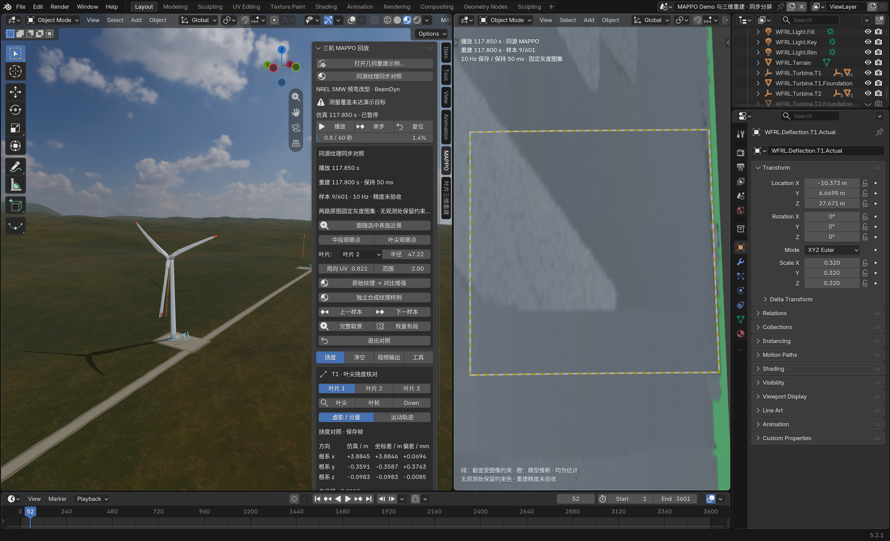

> 2026-10-08 清理后说明：本次隔离安装、测试副本、派生输入与旧开发 ZIP 已移入废纸篓，历史证据保留；当前 0.3.17.1 安装包从 [Release](https://github.com/snode11/wind-farm-blender/releases/tag/v0.3.17.1) 获取。恢复位置与最终场景状态见[清理记录](../../../docs/maintenance/post-v0.3.17.1-cleanup-20261008/清理记录.md)。下文按其验证日期阅读。

# 同源纹理分屏：自检与修复

2026-10-07至08。本次检查发现了实际问题并完成源码、ZIP及日常扩展更新。纹理显示、数据校验、模式往返及独立新进程保存恢复均通过回归。**几何与外观准确性仍为 NOT_ACCEPTED。**

## 发现与修复

| 问题 | 修复后行为 | 证据 |
| --- | --- | --- |
| 同源与合成模式共用显示设置，往返后同源灰度变成青／洋红，观察叶片、位置、UV也被替换 | 两个来源各自保留全部9项显示设置，切回恢复；CURRENT恢复保留当前选择；旧文件中同源误继承的FALSE_COLOR迁回原始灰度 | [修复前原生日常四轮测试](native-edge/attempt01/report.json)、[修复后四轮测试](native-edge/attempt02/report.json) |
| 合成嵌入数据损坏或目标应用失败时，来源选择已提前改动 | 目标恢复成功才提交来源；失败恢复原来源、设置记录和显示状态 | [源码原生损坏恢复及shader测试](frontend-review/source-settings-native.json) |
| 布局忙时“完整取景”返回取消，却先关闭近景追踪 | 先检查忙状态，取消时保留DETAIL与显示选择；实际pending job已检查两种来源 | [日常原生取消验证](native-edge/attempt02/report.json) |
| 运行时放过缺失模型身份、错误逐样本sim_t／blender_frame；构建放过错误绝对起点 | 构建与运行时均核对来源、模型身份、完整绝对／相对时钟、严格类型和全部601样本；补NaN、字符串、布尔值及自洽改哈希负测 | [前后结果对照](data-review/before-after-summary.json)、[负测说明](data-review/AFTER_FIX.md) |

正式资产本身正确且字节未变。8个复核案例中正常包继续接受，7个错误包现在被两层校验全部拒绝；运行时宿主负测止于Blender分配前，不能单独充当窗口验收。旧失败结果和日志均保留。

## 当前构建与安装

当前ZIP：wfrl_blender-0.3.17.zip（本地路径：`outputs/mappo-same-source-texture-20261007-a01/isolated-package/attempt02/package/wfrl_blender-0.3.17.zip`），169个文件，仍为**0.3.17本机未发布修订**。

```text
ZIP SHA-256:
36fc6c837c23da9d99c6e29609775fb8bdb776ae86250758353b9b9b407502d0
```

隔离验证通过后，使用extension CLI的`--enable --no-prefs`更新日常安装。实际模块为`bl_ext.user_default.wfrl_blender`，169个文件与ZIP及构建源码payload逐字节一致。相对于首轮修订，修改3个运行时模块，新增`split_texture_settings.py`，未移除文件。见[安装清单](delivery/daily-installed.json)及[字节保全](delivery/final-preservation.json)。首轮ZIP、安装前备份与证据继续保存在原目录。

## 验证结果

| 层级 | 结果 | 证据 |
| --- | --- | --- |
| 宿主回归 | 85 passed、1 skipped、227 subtests passed | [测试日志](delivery/host-tests.log)、[命令](delivery/commands.json) |
| 源码原生 | 4轮双来源冷缓存恢复、9项设置及真实shader一致、真实嵌入损坏回滚、CURRENT与近景保持、保存重开通过 | [source-settings-native.json](frontend-review/source-settings-native.json) |
| ZIP隔离安装 | 模块身份、包清单、三相机默认和原生投影回归通过 | [package-validation.json](../isolated-package/attempt02/package-validation.json) |
| ZIP隔离窗口 | 实际播放／暂停、寻址、左右相机隔离、完整取景、CURRENT、退出／返回、末端共同循环及保存重开通过 | [window-validation.json](../isolated-window/attempt04/window-validation.json) |
| 日常安装窗口 | 使用真实日常模块完成同一完整流程，通过 | [window-validation.json](../daily-window/attempt02/window-validation.json) |
| 日常四轮往返 | 显示串用issues从11降到0；时间轴、独立合成游标、601形态键及packed图像保持，数据块指针／数量无增长；5次busy-fit取消保持状态 | [report.json](native-edge/attempt02/report.json) |
| 实际鼠标／键盘 | 下一样本53→55，合成17/120独立游标，切回同源恢复原始灰度和B2／47.22m／UV0.822／范围2m，左frame55保留 | [人工操作记录](delivery/manual-ui-observations.json) |
| 全新进程嵌入恢复 | 标准脚本禁止外部纹理包fallback，清空runtime缓存，从嵌入JSON／packed图像恢复；全部数据块、键、UV、纹理身份和8个时刻检查通过 | [independent-reopen-validation.json](../daily-reopen/attempt02/independent-reopen-validation.json) |
| 各来源设置独立重开 | 保存时两套9项设置不同；合成最后编辑未经过模式切换就保存。全新可见进程及3轮往返／退出／CURRENT均恢复正确属性、实际shader和两个时钟，键／UV／packed身份保持 | [prepare-report.json](native-settings-reopen/prepare-attempt01/prepare-report.json)、[settings-reopen-report.json](native-settings-reopen/reopen-attempt02/settings-reopen-report.json) |

设置重开首轮的全文件材质数量断言未通过（173→172），[失败报告](native-settings-reopen/reopen-attempt01/settings-reopen-report.json)保留。只读诊断定位唯一缺失项为`WFRL.ClearanceBeam.Hit`：规范初始load时users=4，seek到保存时刻frame1333后users=0且无fake user，Blender保存时未持久化它；来源材质全部保留。后续以保存文件的实际逐名清单严格复核，只记录这个已证实的差异；新进程内往返的数据块指针和数量严格不变，没有泛化容忍其他差异。见[诊断](native-settings-reopen/material-count-diagnostic.json)及[失败分析](native-settings-reopen/failure-analysis.json)。

用户偏好、规范几何示例、MAPPO manifest、原实验5个来源文件及2404张RGB／掩码、根README与CHANGELOG均保持原SHA。已有dirty工作树没有被清理、暂存或提交，没有Git推送或Release，也没有重跑FAST.Farm、MAPPO、几何求解或纹理生成。

## 当前窗口与边界

新日常测试窗口来自same-source-saved.blend（本地路径：`outputs/mappo-same-source-texture-20261007-a01/daily-window/attempt02/same-source-saved.blend`）。磁盘副本保存frame52；人工往返后窗口停在frame55、同源原始灰度近景，未保存的变化仅属于这个测试副本。旧日常和隔离验证窗口已关闭，未写规范示例或用户自己的场景。



纹理仍有模糊、条带、接缝和叶尖错贴／拖影。这次修复解决软件状态与错误包拒绝，不能提升几何或外观验收状态。60Hz仅为时间轴设置，未验收稳定60FPS、真实缺陷恢复或Windows／Linux行为。原生三相机回归退出仍记录350个未释放块、0.025940MB诊断，回归与进程退出码通过；日志保留，不宣称该诊断已修复。
