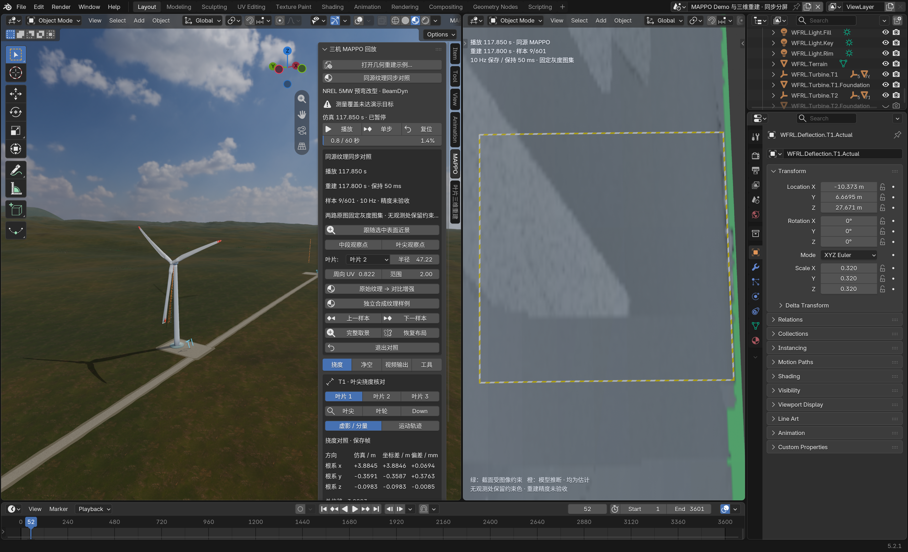

> 2026-10-08 清理后说明：本次隔离安装、测试副本、派生输入与旧开发 ZIP 已移入废纸篓，历史证据保留；当前 0.3.17.1 安装包从 [Release](https://github.com/snode11/wind-farm-blender/releases/tag/v0.3.17.1) 获取。恢复位置与最终场景状态见[清理记录](../../docs/maintenance/post-v0.3.17.1-cleanup-20261008/清理记录.md)。下文按其验证日期阅读。

# MAPPO 同源纹理同步对照：首轮交付记录

后续自检发现并修复模式显示设置串用、失败切换的状态副作用及数据合同校验缺口。**当前使用的 ZIP 是 attempt02**，最新安装、验证结果及保留的失败证据见[自检与修复](self-check/自检与修复.md)。以下记录保留首轮 attempt01 的测试结果与 ZIP 身份，不能视为后续修订的验证证据。

日期：2026-10-07，Asia/Shanghai。已完成本机源码、ZIP、日常扩展安装和 macOS Blender 5.2.1 LTS 的实际窗口验证。左侧继续使用保存的 MAPPO，右侧使用原两相机实验的全部 601 个保存重建状态及同源图像融合的固定纹理；共用时间轴。**软件同步和保存恢复通过，几何与外观准确性仍为 NOT_ACCEPTED。**

这是 **0.3.17 的本机未发布修订**。没有 Git 提交、推送或创建 Release，没有重跑 FAST.Farm、MAPPO 或几何求解。

## 进入与操作

沿用原启动命令，从实际 Git 根目录运行，wrapper 不再额外添加 `launch`：

```sh
cd "/Users/eason/Desktop/wfcrl/wind farm RL"
scripts/blender/run_wfrl_macos.sh \
  --blender "/Applications/Blender.app/Contents/MacOS/Blender" \
  --python /opt/anaconda3/envs/wfrl-mac/bin/python \
  --scene scenes/turb3_row.yaml \
  --mpi /opt/homebrew/bin/mpiexec \
  --fastfarm /opt/anaconda3/envs/wfrl-mac/bin/FAST.Farm
```

在 **N → MAPPO** 加载 MAPPO 后点击 **同源纹理同步对照**。本次原生验收直接使用日常扩展打开保存场景，未执行上述后端启动流程。

- 播放／暂停和时间轴同时驱动两侧。左 MAPPO 源是 40 Hz，在 60 Hz 显示时间轴上插值；右侧保存状态是 10 Hz，在中间显示帧保持最近保存的重建样本。frame 52 显示播放 117.850 s、重建 117.800 s、保持 50 ms。
- **上一样本／下一样本**先暂停，再跳到真实保存时刻，首尾钳制；frame 52 的下一样本是 frame 55。连续播放到末尾按 Blender 原生行为循环，两侧共同回到起点，窗口测试实际记录 frame 3599 → frame 4。
- **中段观察点／叶尖观察点**和叶片、半径、周向 UV 控制右侧近景。近景随保存几何的旋转与变形移动；**完整取景**查看三片叶片。切换左侧相机不重置右侧视图。
- **原始纹理 → 对比增强**只切换显示。在同源模式下，**恢复布局**、退出后返回和保存自己的 `.blend` 重开保留该模式及时间。恢复布局按 CURRENT 保留当前所选数据，不把几何或独立合成自动切成同源。
- **打开几何重建示例…**仍打开原 601 样本几何场景；**独立合成纹理样例**保留原 120 样本实验及其独立游标。

本次验证窗口留在 same-source-saved.blend（本地路径：`outputs/mappo-same-source-texture-20261007-a01/daily-window/attempt01/same-source-saved.blend`） 的同源模式。实际鼠标点击后停在 frame 987 的纹理近景，窗口中的未保存改变仅属于该测试副本；磁盘副本仍保存 frame 52，可再次原生打开。

## 来源与纹理质量

来源是 `outputs/blade-recon-mappo-two-camera-20261004-a02`：T1Down、NacelleT1 两路各 601 张 RGB、1202 张掩码、1202 组动态标定以及 601 个 13 维保存状态。原时刻 0–60 s 对应 MAPPO 仿真 117–177 s。动态标定的 MODEL→CV 语义按历史记录显式适配，数值保持，没有静态化或放宽现有加载校验。完整数据合同与诊断见 [data/README.md](data/README.md)。

原模型与 Blender vendor 哈希相同。冻结纹理器的模型版本不同，但全部 601 状态上的顶点、轴线、截面、面拓扑及 float32 UV 均逐元素位相同，最大几何差为 0。见 [model_compatibility.json](data/model_compatibility.json)。新前端三片叶片的 601 个原生形态键与规范几何场景逐元素位相同。

每片叶片使用一张 **1230×384 RGBA 固定灰度图集**，随动态保存几何变形，没有逐帧重新估计纹理。601 时刻全部匹配；572 帧尝试采样，534 帧提供有效贡献，共 711 个相机×叶片视角。

| 叶片 | 全图集非零 alpha 纹素占比 |
| --- | ---: |
| B1 | 38.6842% |
| B2 | 38.8341% |
| B3 | 38.6579% |

覆盖率分母是 1230×384 全部展向×闭合周向纹素，未按物理表面积加权。未知纹素 alpha=0，显示原约束颜色；绿色截面采用原算法的轮廓邻近判据，橙色截面由模型推断，两者均为估计；绿色不代表整圈可见或深度验收通过。完整取景可能从当前一侧主要看到约束色，表面近景用于查看有纹理贡献的位置。

原 RGB 是 Workbench 材质色仿真图，纹理器转换灰度并归一化明暗。实际图集及窗口可见模糊、展向条带、接缝、叶尖 collage 式错贴和拖影；亮暗块没有真实裂纹、修补或现场材质含义。中段默认 B2、半径 47.225 m、周向 UV 0.8216、范围 2 m。叶尖观察点展示拼接局限，不代表检测出的缺陷。

既有采样器的非有限投影 cast RuntimeWarning 保留在日志中。751 次调用累计 36,563,535 个非有限投影纹素出现次数，正融合权重数量为 0；返回灰度、权重和最终 `val/raw/wmax` 均有限，未观测区域的分辨率数组仍保留 NaN。详细口径见 [sampling_diagnostics.json](data/sampling_diagnostics.json)。重复采样的三张 RGBA 与数据 NPZ 字节相同。

## 构建、安装与保全

交付 ZIP：wfrl_blender-0.3.17.zip（本地路径：`outputs/mappo-same-source-texture-20261007-a01/isolated-package/attempt01/package/wfrl_blender-0.3.17.zip`），168 个文件。

```text
ZIP SHA-256:
45a12c02b22a12be322d107ccad13754641eb676bdbca2b4deb22a6a06b7cdf6
同源资产 manifest SHA-256:
6e542f6bddc9aa57dd8643a6463e8e20054cbe4a5abdec23b319e1e034718ffb
原规范几何示例 SHA-256:
3475e8e43e489076481da2365b3d7179f8667c065ee8dc580486d374c98f616b
```

先隔离安装并验证，再通过 Blender extension CLI `install-file -r user_default --enable --no-prefs` 更新日常扩展。实际加载模块是 `bl_ext.user_default.wfrl_blender`，路径为 `/Users/eason/Library/Application Support/Blender/5.2/extensions/user_default/wfrl_blender`。日常 168 个文件严格等于 ZIP；与安装前相比改动 4 个 Python 文件、新增 11 个文件，153 个文件保持，未移除文件。见 [daily-installed.json](delivery/daily-installed.json)、[deployment-diff.json](delivery/deployment-diff.json)。首次安装 wrapper 只识别 `Installed`，遇到实际成功的 `Reinstalled` 后停止；随后核对成功结果，没有重复安装。

旧日常扩展保存在 daily-install-backup（本地路径：`outputs/mappo-same-source-texture-20261007-a01/delivery/daily-install-backup`），用户偏好保存在 userpref-before.blend（本地路径：`outputs/mappo-same-source-texture-20261007-a01/delivery/userpref-before.blend`）。用户偏好 SHA-256 前后一致：`4f3760f9ccff9ebe67696dc1d617c20a8a0d269026ae20d34d0667cdefb8e8ab`。规范几何示例、原实验、MAPPO manifest 和根 README／CHANGELOG 保持；已有 dirty 工作树保留，未暂存或提交。最终字节及状态清单见 [final-preservation.json](delivery/final-preservation.json)。

## 验证证据

| 层级 | 结果与范围 | 证据 |
| --- | --- | --- |
| 数据与来源 | 601 状态、1202 动态标定、原图哈希、模型与 UV 等价通过；相机名、矩阵、RGB 哈希和时间戳负向检查均拒绝错误输入 | [data_validation.json](data/data_validation.json)、[negative_validation.json](data/negative_validation.json) |
| 宿主测试 | **57 passed，1 skipped，91 subtests passed**；包括新包完整性与生命周期／时间映射 | [host-tests.log](delivery/host-tests.log) |
| 源码原生后台 | 601×3 形态键位相同、13 个寻址时刻、新旧原生求值一致、保存／重开、样本步进及合成来源隔离通过 | [native-validation.json](source-native/attempt03/native-validation.json) |
| ZIP 隔离安装 | 包清单、实际扩展命名空间、三相机默认与原生投影回归通过 | [package-validation.json](isolated-package/attempt01/package-validation.json) |
| ZIP 隔离窗口 | 实际播放推进两侧、暂停、步进、左右相机隔离、完整取景、CURRENT 恢复、退出／返回、末端共同循环、原生保存重开通过 | [window-validation.json](isolated-window/attempt03/window-validation.json) |
| 日常安装窗口 | 使用真实日常模块与测试场景副本完成同一完整流程；实际末端循环已观测 | [window-validation.json](daily-window/attempt01/window-validation.json) |
| 实际鼠标操作 | 点击下一样本、播放／暂停、完整取景及回到纹理近景，HUD 时刻和样本推进符合预期 | [manual-ui-observations.json](delivery/manual-ui-observations.json) |
| 独立新进程重开 | 全新 Blender 直接打开保存副本；清空缓存、禁止外部纹理包 fallback 后从嵌入 JSON 和 packed 图像恢复；数据块指针未替换，601×3 键、UV、纹理身份保持，8 个寻址时刻通过 | [independent-reopen-validation.json](daily-reopen/attempt01/independent-reopen-validation.json) |

原生后台测试最初将解析模型与 Blender 求值简单比较为低于 0.1 mm，frame 2701 未通过。诊断证明新旧原生网格位相同，而规范几何场景已有绝对形态键累计浮点时间误差，三片叶片该处最大解析模型／原生差约 0.321 mm。随后验证明确比较“601 状态键坐标位相同”和“相同时刻新旧原生求值位相同”，另记原生与解析模型差；没有修改原键时间或放宽原精度验收。见 [probe2.json](source-native/evaluation-probe/probe2.json)。

早期隔离窗口 attempt01 在布局未 READY 时进入后续检查；attempt02 的相机相等断言未通过但没有保存失败后的完整快照。后续独立探针及 attempt03、日常窗口都保存了切换前／Down／Front 后快照且相等，未证实持续的生产相机重置缺陷，也未以猜测修改生产代码。失败目录与日志保留。源后台 attempt01 的 import 路径错误同样保留，仅测试脚本补齐源码路径；隔离与日常验收使用真实 `bl_ext` 模块。

隔离三相机回归退出日志另有 Blender `Not freed memory blocks: 350, 0.025940 MB` 诊断，运行退出码与回归均通过；日志保留，不据此宣称跨平台稳定或内存问题已修复。

## 实际窗口与验收边界

[日常近景截图](daily-window/attempt01/same-source-native-reopen.png) · [完整叶轮截图](daily-window/attempt01/same-source-full-rotor.png) · [播放后暂停截图](daily-window/attempt01/paused-after-real-play.png)



本次证明的是同源数据身份、保存几何与固定纹理的同步显示、操作隔离以及原生保存恢复。60 Hz 是时间轴设置，不表示稳定 60 FPS；未验收几何准确性、外观准确性、实体标定、真实缺陷检测或 Windows/Linux 行为。后端启动、现场实验与在线求解没有因该结果获得新的通过状态。
