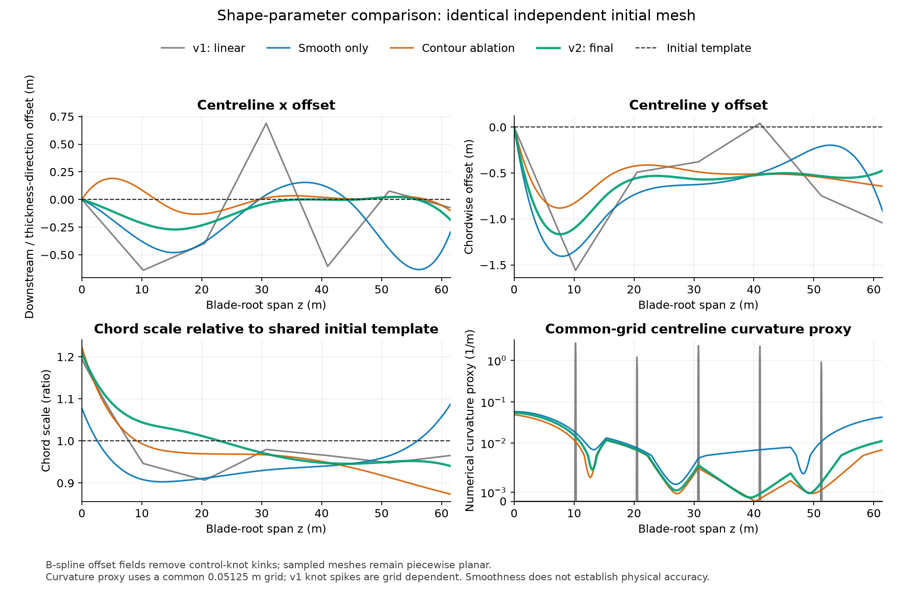

# NREL 5MW 单叶片重建第二轮实际报告

第二轮已完成代码实现、三组运行、RGB 对照与独立评分，状态为 **PIPELINE_COMPLETE_PARTIAL_GEOMETRY**。正式结果为 [T1_B1.ply](reconstruction/T1_B1.ply)，可用 [交互模型预览](reconstruction/model_preview.html) 旋转检查。首轮原模型与证据保留。

全局双向表面误差相对首轮明显下降，固定截面尺寸仍有退化。既定综合判据保持 **NOT_YET_ESTABLISHED**，没有将“更平滑”“视频更吻合”当作完整三维恢复或工程精度验收。

## 已执行的改动和控制

- 中心线偏移与弦长比例改为可选三次 clamped B-spline；旧 `linear` 默认保留。四组初始模板 PLY 逐字节一致，厚度比例、扭转和背面仍由独立粗先验控制。
- 审计确认旧软三角形并集损失会随内部细分和重叠计数变化；这能证明存在额外优化压力，不能单独证明首轮折角的全部原因。[审计数据](renderer-audit.json)
- 新目标从 MP4 RGB 提取的可信外轮廓计算双向稳健距离；独立有效域排除裁切和已审核遮挡，原生 3 px 不确定度随半像素投影缩放。没有从生成端读取物体掩膜、深度或精确表面。
- 可见轮廓选择在反向传播时固定，已验证闭合凸体和轻弯叶片；强折叠、自遮挡拓扑切换和全局收敛不在现有证明范围。真实反向传播与有限差分相对误差 2.06e-11。[后端检查](contour-backend-check.json)
- 新增完整相机／帧清单、原生图像尺寸、可信轮廓坐标／有效域、RGB 来源和非真值分割声明核验。正式拟合缺失轮廓时报错，检查阶段缺项记 null。

## 数据、拟合与冻结

直接复用 [首轮三路 MP4 与允许辅助数据](../01-first-run/formal/algorithm-input/dataset.json)，没有重新采集、复制 PNG 或复制视频。视频每路 1920×1080、20 fps、5 s；t_ref=122.175 s，对应帧 43。只拟合三摄帧 42/43，帧 44/45 不进入梯度。

44/45 已在首轮看过，本轮称为**非盲时序验证**，不是独立盲测。所有模型、配置在本轮时序结果和评分真值检查前冻结：[模型哈希与冻结时间](model_freeze.json)、[实验决策记录](experiment_policy.json)。评分后不再修改模型或调整参数。

| 分支 | 唯一比较目的 | 配置 |
| --- | --- | --- |
| smooth-ablation | 相对首轮只改变参数插值 | 160×90×20 + 320×180×6，lr=0.035 |
| contour-ablation | 同平滑模型、同预算改用可信轮廓目标 | 相同 26 次、lr=0.035 |
| reconstruction（正式 v2） | 拟合曲线末段仍波动后，冻结更小步长和更细分辨率 | 160×90×40 + 320×180×40 + 640×360×20，lr=0.012 |

轮廓后端实际参数为采样间距 1 px、候选／观测上限 300／600、稳健阈值 2 px、距离尺度 10 px（均为当前阶段像素）；这些常量随源码签名保存。旧配置字段 `sigma_px`、`foreground_distance_weight` 在轮廓目标下不生效。

每组都从同一初始模板分别运行无图像对照和视频优化，正则化、优化器、迭代预算一致，只有图像权重归零。正式 v2 有更长预算，因此其改善不能全部归因于目标函数替换。正式模型在评分前指定；未按事后评分挑选最佳分支。

拟合过程使用 [macOS 进程隔离策略](isolation.sb)，拒绝读取源精确资产、internal-capture、两轮 evaluation-only 和网络。[实际拒绝读取证据](isolation_probe.json) 通过。拟合进程本身重新流式解码三路全部 300 帧并核验选中 RGB 哈希：[解码核验](reconstruction/fit_decode_verification.json)。

## 独立三维评分

全部使用相同实际 evaluated truth、t_ref、叶根局部米制坐标和范围，不做自由配准或缩放。全局面积采样 8192、分区采样 2048、seed=20261002；距离为采样点到连续三角面的距离。以下单位均为米，R 为重建、T 为评分表面。

| 模型 | R→T mean | T→R mean | R→T P95 | T→R P95 |
| --- | ---: | ---: | ---: | ---: |
| 初始／无图像对照 | 0.349443 | 0.348322 | 0.854874 | 0.883120 |
| 首轮 v1（26 次） | 0.339828 | 0.303141 | 0.808175 | 0.698259 |
| 仅平滑（26 次） | 0.243080 | 0.246092 | 0.596810 | 0.591016 |
| 平滑＋轮廓（26 次） | 0.192834 | 0.171044 | 0.514790 | 0.406832 |
| 正式 v2（100 次） | 0.183993 | 0.162617 | 0.607790 | 0.511434 |

正式 v2 双向 mean 较首轮约下降 45.9% / 46.4%。根／中／尖三个区域的双向 mean 都较初始降低。等预算轮廓分支的 P95 比正式 v2 更低，正式 v2 并非所有指标最好。

固定截面绝对尺寸误差如下，单位米：

| z | 初始弦长 | v1 弦长 | v2 弦长 | v1 厚度 | v2 厚度 |
| --- | ---: | ---: | ---: | ---: | ---: |
| 9.225 | 0.083083 | 0.057738 | 0.300181 | 0.052494 | 0.238707 |
| 30.750 | 0.003036 | 0.078363 | 0.117310 | 0.000271 | 0.009660 |
| 52.275 | 0.002423 | 0.125813 | 0.122258 | 0.006379 | 0.007068 |

根部尺寸退化最明显；三个截面均闭合，未检测到截面交叉，但这不等同于恢复准确。既定判据要求双向 mean/P95 改善且固定截面尺寸不退化，因此本轮仍未通过。厚度比例和扭转固定于先验、弱观测区和静态形状假设仍构成实际限制。

[完整跨轮比较](evaluation-only/geometry_comparison.json) · [比较图](evaluation-only/geometry_comparison.png) · [正式评分](evaluation-only/reconstruction/scores.json) · [评分前后签名审计](evaluation-only/scoring-audit.json) · [评分配置](scoring_config.json)

## RGB 吻合度与范围

以下是每帧等权宏平均。边界距离在 960×540 硬投影检查后折算为原生 1080p 像素；未扣除注释不确定带，不能换算成三维误差。F 覆盖、B 溢出分别报告，U 不充当确定背景。

| 模型 | 图像组 | masked IoU | F 覆盖 | B 溢出 | RGB→模型边界 mean px | 模型→RGB边界 mean px |
| --- | --- | ---: | ---: | ---: | ---: | ---: |
| 首轮 v1 | 拟合 | 0.8576 | 92.40% | 3.16% | 43.70 | 86.95 |
| 首轮 v1 | 非盲时序验证 | 0.8175 | 92.47% | 9.24% | 78.93 | 72.55 |
| 仅平滑 | 拟合 | 0.9056 | 93.41% | 0.48% | 25.29 | 75.86 |
| 仅平滑 | 非盲时序验证 | 0.8086 | 81.65% | 1.92% | 60.95 | 58.66 |
| 平滑＋轮廓等预算 | 拟合 | 0.9732 | 97.85% | 2.29% | 16.86 | 22.12 |
| 平滑＋轮廓等预算 | 非盲时序验证 | 0.9595 | 98.96% | 7.89% | 31.06 | 13.84 |
| 正式 v2 | 拟合 | 0.9865 | 99.10% | 1.75% | 10.09 | 15.32 |
| 正式 v2 | 非盲时序验证 | 0.9409 | 96.18% | 6.17% | 28.40 | 15.67 |

完整分相机、逐帧及双向 P95 见 [RGB 对照](rgb-comparison/rgb_comparison.json)，可见检查图在 [投影检查](reconstruction/projection-checks/projection_checks.jpg)。正式 v2 的时序 IoU 也低于 26 次轮廓分支，说明增加迭代不能保证全部时序指标改善。

图中参数场的控制点折角消失；输出的 25×12 采样网格仍由平面三角形构成，不能从平滑程度推断物理准确性。全表面可观测覆盖尚未建立，背面、厚度与扭转继续标为依赖先验。

## 计算、存储与验证

正式 v2 视频拟合 27.89 s，重建过程总计 31.36 s，峰值进程 RSS 483.9 MB，CPU 4 线程。该时间不包含 MP4 解码、独立评分和绘图，也不是实时性能承诺。

只缓存 12 份选中标签、有效域和轮廓点；没有全视频 float32 张量、特征缓存或逐迭代高分辨率输出。新增文件实际占用见 [空间统计](storage_report.json)，复用首轮源 PNG/MP4 的占用不重复计算。

本机相关测试 **105 passed in 3.79 s**：[原始测试记录](tests.txt)。覆盖旧链路、同配置对照、B-spline、内部分割不变性、遮挡排除、半像素坐标、来源核验和评分规则。测试通过与完整几何验收分别报告。

本轮可交付的是经过视频计算和独立评分的部分几何及清楚的失败区域。进一步改善根部尺寸需要新增有效观测或另行验证的截面约束；本轮不依据评分真值继续拟合。
