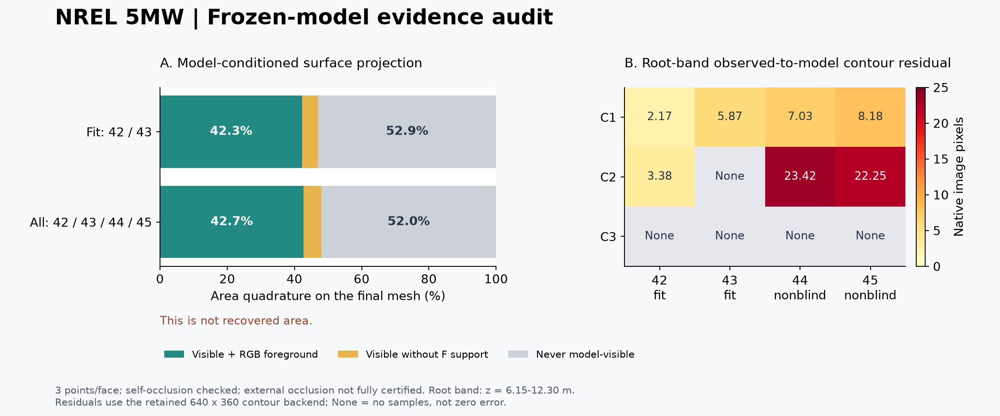

# NREL 5MW 现有视频证据补齐与根部诊断

2026-10-03。承接聊天《判断NREL 5MW方案是否继续执行》。本轮已执行 P0 交付对账、P1 模型表面证据映射与独立面积对账、P2 冻结模型前向诊断。原方案、两轮模型和历史评分保持不变；未启动新采集、Blender、编码或拟合。

**本轮明确了面积差额、模型条件下的观测缺口，以及根部参考轴偏移—弦长的局部补偿。仍不能把退化唯一归因于缺视角、掩膜或截面先验。下一步应围绕参数化和根部可信边界做受控对照，不宜直接加迭代或延长视频。**

[执行补充](../../../../docs/proposal/NREL5MW_现有视频表面证据补齐与根部约束诊断_v1.0.md) · [表面明细](surface/final/README.md) · [参数诊断](parameters/README.md) · [面积对账](area/final/README.md)

## 分层结论

| 项目 | 当前结论 | 证据范围 |
| --- | --- | --- |
| 视频→模型→独立评分流程 | `PIPELINE_COMPLETE_PARTIAL_GEOMETRY` 保留 | 既有真实运行；本轮重新核验视频与模型来源 |
| 本片段全局图像贡献 | 存在限定范围的比较证据 | 历史 v2 双向均值约0.184/0.163 m，较初始/无图像改善；本轮没有重算距离评分 |
| 固定截面不退化联合门槛 | 原 `NOT_YET_ESTABLISHED` 保留 | 根部等截面退化，不更改旧门槛或历史分数 |
| 表面证据交付 | 已有逐面/采样点/轮廓边/截面与相机帧映射 | 有分母的模型条件估计；真实恢复面积、实体遮挡精确面积仍未建立 |
| 根部原因 | 已证实局部响应及补偿；唯一根因未定 | 408次前向配置评估，无重新拟合、无按真值选择参数 |
| 工程几何验收 | 尚未建立 | 用途、绝对误差目标、覆盖要求仍待前瞻确定 |

“仅平滑26次”分支仍使用图像；它不是无图像对照。历史截面“弦长/厚度”是固定叶根局部z平面交线的最小包围矩形长短边，不自动等于材料截面的气动弦长/最大法向厚度。

## P0：现有交付能够对应

- 三路 MP4 重新完整解码 **300帧**，1920×1080，20fps，PTS和共享时间表对应；12张审核帧的解码RGB签名全部匹配原注释。
- 首轮交付与第二轮模型冻结共 **37条签名全部匹配**。拟合启动源码14项中13项相同；`boundary_metrics.py` 与启动快照不同，但与第二轮最终交付及网页版审查包源码相同。最终交付源码清单 **24/24** 匹配。这个时间点差异如实保留，不能声称所有当前源码都等于启动快照。
- 本轮前后核验314份历史输入/结果/相关源码，详见 [baseline_before.json](delivery/baseline_before.json) 和 [最终验证](validation.json)。历史隔离探针仍是原运行证据；本轮没有重新启动当年的拟合进程验证隔离。
- 既有完整优化日志、F/B/U、轮廓、MP4和评分真值都可读，无需重做实验。

[交付核验](delivery/delivery_audit.json) · [源码时间点对账](delivery/final_source_reconciliation.json)

## P1：1.06018 m²面积差额已经闭合

只对独立评分端已保存的真值三角面严格裁剪，不加封口、不对齐、不调整坐标。

| 域 | 面积 m² |
| --- | ---: |
| 全部真值网格 | 501.206601629327 |
| 历史三段合计，0≤z≤61.5 | 500.146421049053 |
| z<0 | 1.044692426133 |
| z>61.5 | 0.015488154140 |
| 域外合计 | 1.060180580273 |

总面积闭合残差 **3.41×10⁻¹³ m²**；与历史每个分区的面积逐项一致。最小z为−5.36441803×10⁻⁶ m，最大z为61.5231514 m。略低于0的片段接近平行于裁剪平面，所以z厚度很小仍可能分走可观面积；其物理/导出原因没有在本轮确定。

**这部分是统计域差额，不是“背面”“被挡面积”或“重建缺失面积”。** 真值网格边界/非流形边均为0，未做三角形自交检查；拓扑闭合也不能证明恢复正确。原PLY没有材料侧和前后缘标签，相关语义面积继续为null。

[逐原三角形归属](area/final/per_triangle_area_accounting.csv) · [域外片段坐标](area/final/outside_span_pieces.json)

## P1：表面与图像已经建立具体映射

对初始模板、26次可信轮廓分支、正式v2的同一拓扑（300顶点/596面），每面3个面积积分点；相机射线对全部同模型三角面求交检查自遮挡。外部结构未加载为真值几何，只使用已有审核F/B/U和独立轮廓有效域。

| 模型／图像组 | 模型面积分母 m² | 可见且落在F | 可见但无任何F | 从未模型可见 |
| --- | ---: | ---: | ---: | ---: |
| 初始模板／fit | 498.869 | 34.166% | 14.333% | 51.501% |
| 26次可信轮廓／fit | 496.604 | 42.342% | 4.737% | 52.921% |
| 正式v2／fit | 509.933 | 42.339% | 4.713% | 52.948% |
| 正式v2／全部12视图 | 509.933 | 42.662% | 5.321% | 52.017% |

表格三列互斥；分母为各自模型面积，不是真值面积。F表示模型点投影与审核前景一致，不能解释为该点的三维位置已测得。三点积分没有做密度收敛证明，带边界和薄小区域存在近似误差。

正式v2根部诊断带z∈[6.15,12.30] m中，fit可见F约43.568%，从未模型可见约54.978%；这是采样带面积口径，不是历史0–20.5 m根分区。固定z=9.225截面的fit可见F约43.619%、从未模型可见约56.381%，这里分母改为**截面周长**。

轮廓分为具备约束资格（eligible）、3原生像素不确定带内一致、带外活动残差。带外轮廓仍有约束，不能因不吻合就删去。正式v2的fit有107个轮廓邻接面，其中81个有带内一致采样；邻接面数不能换算成恢复面积。

三模型在fit任一视图中出现分类分歧的加权采样面积占初始模板分母34.213%，明确标为不确定。该数不是v2未恢复比例。即使三模型一致，它们仍共用厚度比例、扭转和粗截面先验。

记录包括64,368条表面采样、98,523条轮廓边记录、6,480条截面记录、21,456条模型分歧记录，均可追到face/sample ID、相机帧、像素和排除原因。压力面/吸力面未认证，侧面只按未扭转模板厚度轴正负半侧标记。

## P2：根部有图像响应，但观测分布不均

从保存参数恢复的模型与冻结PLY逐顶点最大坐标差 **4.95×10⁻⁹ m**，面拓扑完全相同。在根部首个自由B-spline控制系数上，对参考轴x/y偏移与弦向半宽做±0.02/±0.05 m物理归一化扰动。

以下是640×360下旧轮廓后端的**根带观测→模型平均距离**，折算为原生图像像素；归属来自冻结模型的最近轮廓边，不是材料点对应。

| 相机 | 42 fit | 43 fit | 44 非盲 | 45 非盲 |
| --- | ---: | ---: | ---: | ---: |
| C1 | 2.171 | 5.865 | 7.032 | 8.176 |
| C2 | 3.384 | 无根带样本 | 23.425 | 22.253 |
| C3 | 无根带样本 | 无根带样本 | 无根带样本 | 无根带样本 |

不能说根部完全无图像信息，也不能以全图IoU或C3尖部残差替代根部约束。C1和C2在42/43帧对根部环中心的视线夹角仅约0.342°/0.330°；这是声明位姿下的方向几何，不能直接变成真实相机不确定度或三角化精度结论。

扩展300/600全局采样上限后，C1根部O2C均值变化很小：42帧2.171→2.177 px，43帧5.865→5.855 px；C2的43帧仍无根带样本。现有结果**不支持把采样上限认定为根部退化的充分原因**。扩展采样仍保留每边512点和工作像素间距等约束。

## P2：已经实际核验局部补偿

由640 fit根带±0.02m响应得到的弱方向，按 `[参考轴x, 参考轴y, 弦向半宽]` 排序约为 `[0.7814, 0.5417, -0.3097]`。先固定此方向，再做48次组合前向；没有据评分真值选择方向，没有把任何扰动模型选为新正式结果。

| 归一化幅度 | 单x方向对称变化RMS px | 单y | 单半宽 | 固定组合 |
| --- | ---: | ---: | ---: | ---: |
| ±0.02 m | 1.468 | 1.941 | 2.107 | 0.285 |
| ±0.05 m | 2.429 | 3.681 | 4.329 | 0.579 |

表内均使用640 fit根带固定495个观测点，数值为 `RMS[(d+−d−)/2]`，单位原生像素。

组合正/负方向相对原模型的实际RMS也较小，分别约0.341/0.320 px、0.722/0.638 px，因此不只是对称差分相互抵消。它支持这个有限幅度、局部参数子空间中的补偿。幅度是连续场尺度，组合的弦长变化只是厘米量级，**不能据此解释全部约0.30 m截面误差，更不能证明任意尺寸都不可辨识**。

模型使用 `y=chord*(0.25−0.5*cos(theta))`。半宽扰动a除了改变绝对厚度，还会把几何截面中心沿旋转弦向移动a/2；`center_x/y`是参考轴offset。因此这部分耦合同时受参数化影响，不能全归因于缺视角。

双幅度响应并未收敛为稳定Jacobian；fit根带单变量变化约33%–44%，其它组可更大，组合线性预测的向量相对误差约109%，定义为 `||actual−predicted|| / ||actual||`。SVD来自unsigned原始O2C距离，不是经过稳健损失/不确定带处理后的置信区间。存在弱响应不等于完整可辨识性判断。

## 现有视频候选与P3建议

已查看三路全部100帧总览。C1的41、46、47帧根部环完整入镜，是后续精审候选；相对43帧方向只差0.984°、1.292°、1.676°。C2有40/41/46/47局部候选，C3这次B1过境没有42–45之外的新候选。其它过境不自动归为B1，未新增掩膜或拟合帧。

[C1全片](delivery/C1_all100.jpg) · [C2全片](delivery/C2_all100.jpg) · [C3全片](delivery/C3_all100.jpg) · [候选与方向](delivery/candidate_review.json)

**建议下一次先冻结“参考轴—截面几何中心耦合”的单因素对照。** 固定现有图像、掩膜、截面先验和预算，对弦长变化施加解析中心补偿，分开检查“只改截面尺度”与“只移动几何中心”的图像响应。若准备进入新拟合，应事先说明是否保持相同物理正则化；单纯换参数坐标也可能改变正则化和优化路径，不能把这些同时变动伪装为只改一个因素。

原图中C1排除域与C2裁切附近根部轮廓仍需逐图核对，尤其要确认活动残差的几何归属。只有这一步或单因素对照显示现有信息确实不足，再考虑审核少量已有候选或设计不同观察方向。当前没有证据要求延长整段视频、释放全部厚度/扭转参数或单纯增加迭代。

P3本轮只形成此计划，未执行新的拟合。用途误差目标、允许退化和覆盖要求为 `PENDING_USE_CASE_TARGETS`，不得根据当前0.3002 m误差反设一个刚好通过的阈值；44/45和本片段继续标非盲。

## 验证与复现

新诊断模块的面积裁剪、遮挡、轮廓资格、半像素/归属、参数恢复及扰动测试见 [validation.json](validation.json)。独立短核验中，P2全域loss与旧真实后端差5.59×10⁻⁹，物理归一化误差不超过2.55×10⁻⁸ m；保存响应矩阵重算SVD一致。

运行入口：`scripts/nrel_existing_video_audit.py`、`wfrl.nrel_reconstruction.area_audit`、`surface_audit`、`parameter_audit`。各子报告记录实际命令；重新运行必须使用新的空目录。`parameter_audit --combination-only`只能在已有360结果上追加组合输出，拒绝覆盖。`build_summary.py`仅从保存JSON重建上图。

`area/final/`与`surface/final/`是最终审计；父目录的初跑记录保留。参数原360结果和追加48结果分别保存。所有诊断与代码都在本轮新增位置，没有回写旧验收结论。
