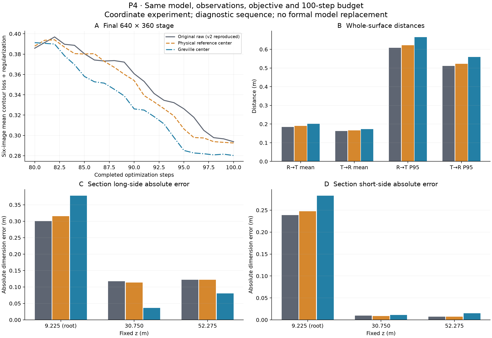

# NREL 5MW：P4 可逆中心坐标对照与 RGB 精审

2026-10-03。状态：`P4_CONTROLLED_EXPERIMENT_COMPLETE / GREVILLE_NOT_ADOPTED / GEOMETRY_ACCEPTANCE_PENDING`。

**可逆 Greville 坐标已实现并验证，但本次同预算实验没有修复根部重建。** 相对主对照，它降低了图像目标，却增加了全局双向表面距离和根截面尺寸误差。正式 v2 保留，不采用新分支、不据评分继续调参。另有四段 RGB 边界通过候选精审，尚未进入拟合。



图 A 只展示共同的最后640×360阶段，避免把不同分辨率的目标直接比较；横轴为已完成步数，100处为最终模型的重新前向值。B 的 R/T 分别为重建/评分表面；C/D 使用固定截面最小包围矩形长/短边，并非独立估计了真实翼型弦长、厚度。[矢量图](p4_summary.pdf)

## 1. 实现与实验公平性

新增 [greville_model.py](implementation/wfrl/nrel_reconstruction/greville_model.py) 使用 `Gg=A C+Dg(ell)` 的逆映射恢复原参考轴控制系数。只有12个独立的非根中心变量和7个原弦长raw变量；根几何中心保持从属，原25环几何、正则、参数域及厚弦比/扭角先验不变。没有另建独立几何中心样条。

为区分中心tanh映射与坐标定义的影响，在运行前补充了第三臂。主比较为下表后两行，第一行连接历史结果。

| 分支 | 中心参数 | 弦长参数 | 比较目的 |
|---|---|---|---|
| 原raw / original_raw | Cfree=5 tanh(raw) | ell=0.35 tanh(chord_raw) | 复现正式v2 |
| 物理参考轴 / physical_reference_center | Cfree=5q | 同上 | 主对照 |
| Greville / greville_normalized | q=(Gfree−Dg(0)free)/5 | 同上 | 只改变中心坐标定义及其优化度量 |

三臂都从同一零参数独立模板开始，未从拟合后的v2暖启动；每臂各跑100步视频拟合和100步仅正则对照。原160×90×40、320×180×40、640×360×20阶段、Adam lr=0.012、clip=10、CPU4线程、seed=20261002、每步6张图等权均保留。共 **300个视频优化步、1800次训练图像前反向调用**，另有300个无图像步。预检/报告不计入该预算，未声称相同FLOPs。

三组全部 **0次可行性回退**，中心边界最小余量均超过3m，弦长log边界最小余量超过0.15；约束回退不是本次结果差异的来源。全部初始网格字节相同，每臂无图像最终结果仍等于初始。原raw的100步loss轨迹和最终PLY均精确复现正式v2。

实现检查：两个新坐标×三分辨率的实际图像预检中，初值顶点、完整目标、逐帧分项及计数差均为0，链式梯度相对L2最大 `1.0676e−7`。其他可行状态通过多组float32/float64代数及合成梯度测试。真实轮廓预检只在初值进行；不能把它扩大为整个优化过程的光滑性证明。**46项相关测试通过**，数值容差不是测量精度。

## 2. 图像目标改善没有转化为几何改善

以下图像值均在640×360计算，6图等权。完整目标包括原正则；非盲列只有图像项。工作像素robust目标无米制精度含义。

| 分支 | 拟合图像项 | 拟合完整目标 | 44/45非盲图像项 |
|---|---:|---:|---:|
| 原raw | 0.285658 | 0.293774 | 0.575219 |
| 物理参考轴 | 0.284262 | 0.292550 | 0.570014 |
| Greville | 0.271518 | 0.280230 | 0.495246 |

Greville相对主对照的最终完整训练目标低 **4.21%**，非盲图像项低约 **13.12%**。44/45已经看过，不能因此声称盲测泛化改善。

三维评分沿用原全局8192/分区2048面积采样、seed、相同三角面距离算法与叶根米制坐标，没有自由配准或缩放。以下均为米：

| 分支 | R→T mean | T→R mean | R→T P95 | T→R P95 |
|---|---:|---:|---:|---:|
| 原raw / 正式v2复现 | 0.183993 | 0.162617 | 0.607790 | 0.511434 |
| 物理参考轴 | 0.189727 | 0.166108 | 0.622291 | 0.522152 |
| Greville | 0.201855 | 0.173180 | 0.664901 | 0.558768 |

Greville相对主对照的双向mean分别增加 **0.012128 / 0.007072m**，双向P95增加 **0.042610 / 0.036616m**。四项全局指标均变差；原raw与历史正式v2的全局、分区和截面评分一致。

固定截面长/短边的绝对尺寸误差如下，单位米：

| z / m | 原raw长边 | 物理参考轴长边 | Greville长边 | 原raw短边 | 物理参考轴短边 | Greville短边 |
|---:|---:|---:|---:|---:|---:|---:|
| 9.225 | 0.300181 | 0.315348 | 0.377747 | 0.238707 | 0.247648 | 0.283045 |
| 30.750 | 0.117310 | 0.113826 | 0.036433 | 0.009660 | 0.008772 | 0.010963 |
| 52.275 | 0.122258 | 0.121846 | 0.080471 | 0.007068 | 0.007148 | 0.015106 |

Greville的中/尖截面长边有所改善，但三处短边都较主对照变差，根部长边也变差。根部长/短边绝对误差分别增加 **0.062398 / 0.035396m**；不能用中段改善掩盖根部退化。

三组原综合判据均为 **`NOT_YET_ESTABLISHED`**；用途要求仍为 `PENDING_USE_CASE_TARGETS`。本片段支持“更低轮廓目标不保证更准确三维形状”的实际反例，也支持拒绝将这次坐标变换当作已验证根部修复。它不能证明Greville在所有预算/数据上更差，亦未确定退化的唯一原因。没有新增可观测信息，厚度比例、扭转和隐藏面依旧依赖先验。

## 3. C1 #42 的独立 RGB 精审

查看1920×1080完整原图及原样crop后，确认 x≈1050–1775、下缘y≈912–925–896的四段边界属于白色目标叶片与深色背景的可见分界，未见外物切过。17个稀疏定位锚点及±3px邻域均处于旧contour-valid无效域。

这些可作为后续独立标注分支的候选，不是17个已新增有效观测。左侧杆件边缘、上方细杆与内部阴影排除；被杆件遮住的边界不外推。与旧域交接的短段保留去重及域衔接问题。±3px是未校准的审阅容差，不能宣称标注精度。

[逐段决定与审阅图](rgb-review/README.md)未读取网格投影或真值来筛选候选，也未改变原FBU、mask或contour。本轮三组坐标对照均使用原观测。不能把这些像素段直接等同于三维根带，或把P3模型投影线长记为可新增观测量。

## 4. 冻结、隔离与复现

机器协议和运行前补充分别为 [protocol.json](protocol.json)、[protocol_addendum.json](protocol_addendum.json)；[可读协议](protocol.md)解释三臂定义。三组模型统一冻结于 **2026-10-03 09:55:10（北京时间）**，之后才计算非盲残差与独立三维评分，未按评分回调参数。

拟合前复用了原入口的300帧MP4流式解码及12图RGB来源校验。其中44/45数据被来源验证读取，但未进入拟合目标/梯度，也未在冻结前计算其模型残差。后评使用精确顶点NPZ，避免重新执行atanh/tanh产生舍入。三维评分按原PLY流程执行。

macOS隔离策略拒绝评分目录、精确资产等路径及网络；[实际探针](isolation_probe_native.json)确认被测evaluation-only标记与Blender资产源码读取遭拒。`isolation_probe.json`保留了最初嵌套sandbox不被宿主允许的失败记录，不把它当成功证据。

[独立复核](independent_review.md)确认冻结输出39/39、拟合源码22/22、入口输入73/73签名一致；[评分记录](evaluation-only/evaluation_record.json)确认141个保护文件在评分前后相同。**451个历史文件全部保持不变**，详见最终 [validation.json](validation.json)。没有采集、渲染、编码新视频或重跑仿真。

在仓库根目录复现时，使用新输出父目录，并复制原protocol/addendum到该父目录；拟合入口拒绝覆盖已有输入冻结或模型。对应本次实际命令为：

```bash
/usr/bin/sandbox-exec -f outputs/nrel-video-single-blade/stages/05-p4-greville/isolation.sb /opt/anaconda3/envs/wfrl-mac/bin/python -m wfrl.nrel_reconstruction.greville_experiment fit --source outputs/nrel-video-single-blade/stages/02-second-run --input outputs/nrel-video-single-blade/stages/01-first-run/formal/algorithm-input --output outputs/nrel-video-single-blade/stages/05-p4-greville/fit
/usr/bin/sandbox-exec -f outputs/nrel-video-single-blade/stages/05-p4-greville/isolation.sb /opt/anaconda3/envs/wfrl-mac/bin/python -m wfrl.nrel_reconstruction.greville_experiment nonblind --source outputs/nrel-video-single-blade/stages/02-second-run --output outputs/nrel-video-single-blade/stages/05-p4-greville/fit
```

评分命令与策略见 [评分子报告](evaluation-only/README.md)。复现须保留允许输入与评分隔离，不把此固定实验脚本当成通用参数搜索工具。当前nonblind接口核验签名但未额外拒绝另一个source路径，本次实际调用使用签名的原目录。

## 5. 交付与下一步

- [冻结模型、精确顶点、优化日志](fit/model_freeze.json)、[每臂实际预算及耗时](fit/fit_summary.json)。三臂视频拟合分别26.28/26.34/26.80秒；不包含解码、预检、评分和绘图，不是实时承诺。
- [完整独立评分及跨臂汇总](evaluation-only/cross_branch_summary.json)，[非盲逐帧残差](fit/nonblind_residuals.json)。
- [测试原始输出](tests.txt)、[测试签名](test_validation.json)、[本轮实现快照](implementation/manifest.json)。
- [上阶段P3](../04-p3-center-scale/README.md)。历史正式结果与原审阅包保留；本轮补充包不重复复制原视频/原观测/真值网格。

下一阶段应单独冻结C1 #42候选边界的新标注和局部有效域，处理遮挡、交接与去重，再进行只改变观测的消融。不能将本轮稀疏审阅锚点直接连成密集训练点，也不应把增加迭代当作已获得几何改善依据。本轮在固定的三臂实验与独立评分结束后停止，未实施该新观测消融。
