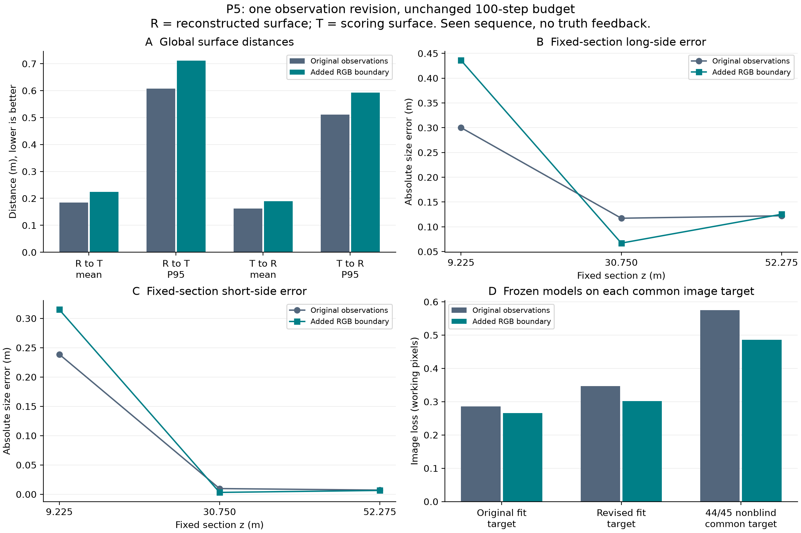

# NREL 5MW：P5 局部 RGB 边界观测消融与本轮收尾

2026-10-03。状态：`P5_OBSERVATION_EXPERIMENT_COMPLETE / REVISED_BOUNDARY_NOT_ADOPTED / GEOMETRY_ACCEPTANCE_PENDING`。

**最后一轮 P5 已完成；保留正式 v2。** 新增 C1 #42 的可见下缘边界后，固定根截面的长、短边绝对误差分别增加 **13.58 cm、7.62 cm**，四项全局双向 mean/P95 也全部变差。共同图像目标及 44/45 非盲残差降低，但没有转化为根部或全局三维改善。本次实验在预先冻结的两组各 100 步结束后收尾，没有继续调参或展开下一轮。

图中 R/T 为重建/评分表面；B/C 是固定 z 截面最小面积包围矩形的长短边误差，不是已独立测出的真实气动弦长与厚度。D 在每个固定目标内比较两组冻结模型，不能将不同观测目标的数值混作同一训练目标。图像项使用工作像素稳健目标，没有米制精度含义。[矢量图](p5_summary.pdf) · [图表数据](summary_results.json)

## 1. 已完成的观测修订

依据 [P4 的独立 RGB 精审](../05-p4-greville/rgb-review/README.md)，本轮从原生 1920×1080 的 C1 #42 实际 MP4 RGB 提取 R1–R4 可见下缘。固定搜索窗 x=1050–1775、y=885–935；逐列测量亮度下降位置，没有连接旧的 17 个稀疏定位锚点生成训练点。726 列均有 RGB 测量；端点防护排除 16 列，接受 **710 个亚像素边界点**，x=1058–1767。没有按模型投影、损失或真值误差筛选边界。

原 **1104 个**轮廓点完整保留，顺序和数值不变，修订后共 **1814 点**。原有效域保留，新增约 ±8 px 的局部窄带 **11,360 像素**，与旧有效域交集为 0；没有打开整个下方矩形排除区。J1 交接段继续暂缓，不外推被杆件遮挡的边界。原 F/B/U 文件及其他 11 张观测不变。原生 **3 px** 不确定带沿用旧损失约定，未经过重复标注或测量精度校准，不能从亚像素存储精度推断标注精度。

原损失的 `max_observed=600` 和采样算法保持不变：原版本有效抽取 600 个旧点，修订版本抽取 **365 个旧点＋235 个新点**。因此本轮检验的是完整观测版本变化，包含局部有效域与目标内部空间权重的变化；不能把 710 点视为 710 份独立几何信息，也没有单独区分“有效域变化”和“采样权重变化”的贡献。[采样索引核验](sampling_diagnostics.json)

[标注说明与叠图](annotation/README.md) · [冻结标注](annotation/annotation.json) · [逐列测量](annotation/edge_measurements.csv)。标注者知晓 P3/P4 指出的 RGB 区域，且检查文件结构时意外显示过标定/姿态元数据；该暴露已记录，未使用变换值、计算投影或读取模型/真值/损失来选边。这不是完全盲标注。

## 2. 两组实验与实际预算

`original_raw` 使用原观测，`revised_boundary` 只替换 C1 #42 的 `contour_points_path` 与 `contour_valid_path`。两组采用原 `BladeModel` 的 B-spline 模式、相同零参数独立模板、原损失公式与权重、相同正则和原始 `optimize._fit`；没有从正式 v2 暖启动，没有改变坐标参数表达。

每组均为 **100 个视频优化步、600 次训练图像前反向调用**：160×90×40、320×180×40、640×360×20，Adam lr=0.012、梯度裁剪 10、CPU 4 线程、seed=20261002，每步 6 张拟合图等权。总计 **200 个视频步、1200 次图像前反向调用**。无图像对照实际运行一次相同预算的 100 步，并由两组共享；图像权重为 0 时，修改轮廓观测不会影响正则梯度。各组初始和无图像网格仍相同，不把共享计算时间重复计为两次实验。

实际视频优化耗时原版本 **27.18 s**、修订版本 **26.16 s**；共享无图像对照约 **0.35 s**，不包含解码、残差、独立评分或制图，不是实时性能承诺。预检与冻结后的前向残差不计入优化预算，也未声称 FLOPs 相同。[实际预算](fit/fit_summary.json) · [协议](protocol.md) / [机器协议](protocol.json)

原观测组的 initial/prior-only/final 三份 PLY **逐字节复现正式 v2**，全部全局、分区和截面评分也精确复现；两组基线和初值一致。没有通过改变原对照制造比较差异。[评分中的复现核验](evaluation-only/evaluation_record.json)

## 3. 独立三维评分

保持原真值、叶根米制坐标、8192 个全局面积样本、2048 个分区样本、seed=20261002 和原连续三角形距离算法；不配准或自由缩放。以下单位均为米。

| 模型 | R→T mean | T→R mean | R→T P95 | T→R P95 |
|---|---:|---:|---:|---:|
| 共同初始 / 无图像对照 | 0.349443 | 0.348322 | 0.854874 | 0.883120 |
| 原观测 / 正式 v2 精确复现 | 0.183993 | 0.162617 | 0.607790 | 0.511434 |
| 新边界观测 | 0.224019 | 0.189591 | 0.710826 | 0.592301 |

新边界相对正式 v2 的双向 mean 增加 **0.040026 / 0.026974 m**，双向 P95 增加 **0.103035 / 0.080866 m**。它仍优于共同初始的四项全局指标，但比保留的正式 v2 更差；全局优于初始并不补偿固定截面的退化。

| 固定 z / m | 原长边误差 | 新长边误差 | 长边变化 | 原短边误差 | 新短边误差 | 短边变化 |
|---:|---:|---:|---:|---:|---:|---:|
| 9.225 | 0.300181 | 0.435971 | +0.135790 | 0.238707 | 0.314956 | +0.076249 |
| 30.750 | 0.117310 | 0.067086 | −0.050224 | 0.009660 | 0.003147 | −0.006513 |
| 52.275 | 0.122258 | 0.125342 | +0.003085 | 0.007068 | 0.006476 | −0.000592 |

根部明显退化；中截面长短边改善；尖截面长边轻微变差、短边轻微改善。根分区 [0,20.5] m 的双向 mean/P95 全部变差；中分区 R→T mean 微增、T→R mean 降低，但双向 P95 都增大；尖分区四项距离减小。不能用中/尖局部改善代替根部结论。评分根分区也不等于 P3 的 [6.15,12.30] m 诊断根带。完整分区 mean/P95 与标准误差见 [跨组评分](evaluation-only/cross_branch_summary.json)。

两组原综合判据均为 **`NOT_YET_ESTABLISHED`**：要求相对初始与同配置无图像对照的双向 mean/P95 均改善，且每个固定截面尺寸误差不得退化。共同初始根部长/短边误差仅为 0.083083 / 0.106732 m；本轮两组根部仍退化。用途验收保持 **`PENDING_USE_CASE_TARGETS`**，没有根据当前误差反推“通过”阈值。

## 4. 同一图像目标下的对照

所有值在 640×360 计算，6 张图等权，只含图像项。每一行固定相同观测目标，再比较两组冻结模型。

| 共同目标 | 原观测拟合模型 | 新边界拟合模型 | 图像项相对降低 |
|---|---:|---:|---:|
| 原 42/43 观测 | 0.285658 | 0.265392 | 7.09% |
| 修订 42/43 观测 | 0.346864 | 0.301678 | 13.03% |
| 原 44/45 非盲观测 | 0.575219 | 0.485572 | 15.58% |

该结果在两个共同拟合目标及非盲时序目标上都有较低图像残差，仍产生更差的根部和全局三维评分。它支持拒绝将这个固定预算的观测修订当作根部修复，不能证明 RGB 边界归属错误，也不能确定参数族、静态近似、有效域筛选、空间权重或有限预算之中哪个是唯一原因。

两组各自训练的最终完整目标分别为 0.293774、0.310383；这两个数对应不同观测目标，不能把两者相除解读为同目标拟合改善或退化。[共同目标逐帧残差](fit/cross_observation_residuals.json) · [44/45 非盲逐帧残差](fit/nonblind_residuals.json)。44/45 已被以前阶段查看，不能称为独立盲测或泛化证据。

## 5. 冻结、隔离与验证

标注于北京时间 **10:21:08** 冻结；两组全部几何于 **10:27:26** 签名冻结，之后才计算共同目标残差；完整模型和日志于 **10:27:29** 冻结；独立评分的签名门槛于 **10:28:06** 通过，才开始读取真值与历史评分。没有从评分反馈修改标注、参数、预算或选择检查点。[几何冻结](fit/geometry_freeze.json) · [完整冻结](fit/model_freeze.json)

正式拟合入口重新完整解码三份 MP4 共 **300 帧**，核验 12 张原选帧的 RGB 来源。只有 42/43 的 6 张图进入梯度；44/45 在冻结前只用于来源验证。OS 策略拒绝 Blender 精确资产、生成端与历史/本轮评分目录，并禁用网络；本轮 [3 个实际读取探针](isolation_probe.json)全部拒绝，不将路径分目录当作隔离证明。没有新采集、渲染、编码视频或重跑物理仿真。

**92 项相关测试通过**，覆盖真实小视频来源、严格协议与输入变更拒绝、原生像素缩放、标注提取/去重、图像目标与几何评分。[测试输出](tests.txt) · [测试与源码签名](test_validation.json)。源码快照保存 **32 个实现与测试文件**，[快照清单](implementation/manifest.json)用于复查实际运行来源。

独立评分完成两组×4 元数据对象共 **8/8 contract 核验**，**162 个评分保护文件**在运行前后签名相同。全部冻结输入、源码、标注和模型通过终检，**554 个范围内历史文件保持不变**。[交付终检](validation.json) · [拟合独立复核](independent_fit_review.md) · [评分独立复核](independent_evaluation_review.md)

复现使用新输出目录，不覆盖本次冻结结果。原算法输入、原观测、评分真值仍引用原位置，不重复复制大型资产。执行日志见 [fit.log](fit.log)、[nonblind.log](nonblind.log)、[evaluation.log](evaluation.log)；本轮入口为 [源码](../../../../wfrl/nrel_reconstruction/observation_experiment.py)，评分入口见 [评分说明](evaluation-only/README.md)。机器协议绑定当前绝对路径，换目录复现应另建协议与隔离文件并留档。

## 6. 收尾状态与仍未完成的研究目标

最近这条诊断线已完成 **P0–P5 共 6 个工作阶段**。P5 是这次授权的最后一个固定实验；本次到此收尾，正式 v2 保留，新的模型只作为失败修复候选与反例证据保存。

三路视频→单叶片模型→独立评分的流程已跑通，状态仍为 `PIPELINE_COMPLETE_PARTIAL_GEOMETRY`。根部精度尚未解决，厚度比例、扭转和隐藏面仍依赖先验，完整表面恢复与工程用途精度/覆盖验收尚未建立。本轮停止不代表 A–D 整体研究路线已完成：当前工作仍属于 B 的单叶片几何重建验证与改进，C 纹理与缺陷地图、D 局部损伤计量没有因此得到验证。

历史 [P3](../04-p3-center-scale/README.md)、[P4](../05-p4-greville/README.md)及正式 v2 均原样保留。本报告记录已运行结果与限制，不将下一项可能研究工作作为本轮自动执行任务。
