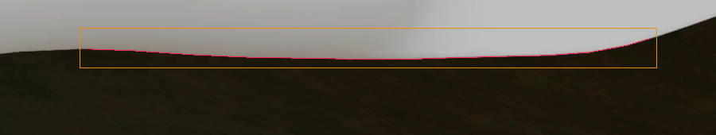
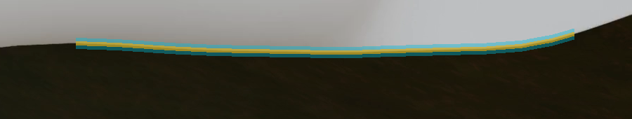

# P5：C1 #42 下缘 R1–R4 的冻结 RGB 观测 v1

2026-10-03，状态 `FROZEN_RGB_OBSERVATION_REVIEW_ONLY`。冻结时间为 **2026-10-03 10:21:08（北京时间）**，早于后续模型前向与拟合。只更换既有 fit 帧 C1 #42 的轮廓点路径和轮廓有效域路径；FBU 继续引用原文件，其他相机/帧引用原观测。没有改动历史观测。

已从原生 RGB 的**每一列真实像素**提取 710 个下缘亚像素位置，追加到原 1104 个轮廓点后，总计 1814 个点。新增点不是 P4 的 17 个定位锚点插值，也不代表 710 个独立几何信息量。修订观测集合会改变下游 `max600` 的抽样份额，应将其解释为整个观测版本的变化。

## RGB 选择与提取

先检查完整 [1920×1080 原生 RGB](../../04-p3-center-scale/rgb/C1_000042_native_rgb.png)、未缩放/未锐化的 [下方上下文 RGB](../../05-p4-greville/rgb-review/lower_context_rgb.png) 与 [局部 RGB](../../05-p4-greville/rgb-review/root_lower_rgb.png)。白色叶片与深色背景的外分界在 R1–R4 连续可见，未见遮挡物穿过。左侧杆件、顶部细杆和内部阴影不属于这段外分界，不补出隐藏边界。

固定 [提取协议](protocol.json) 搜索原生 x=1050–1775、y=885–935。每一列独立寻找最大向下亮度下降，在该位置上方四行与下方四行取亮/暗平台中位数，再在局部原生行间求平台中点的线性亚像素交点。亮度使用 `0.2126R+0.7152G+0.0722B`；固定要求亮平台≥100、暗平台≤70、对比≥60、单行下降≥20，且局部只有一个中点穿越。没有列间平滑、插值、外推或缺失列补点。16 列仅因端点各 8 px 防护而排除，726 个测量列均满足固定 RGB 判据；放行 x=1058–1767。

下图红色像素为逐列位置，橙框为固定搜索域。已目视检查完整叠图与两个局部叠图，线条跟随白色/深色外边，端点前停下，没有连接被遮挡区域。



## 局部有效域、容差与历史去重

新增有效域只位于逐列外缘上下 **±8 px 的垂直窄带**，裁到上述搜索域并保留端点防护。黄色为 **±3 px 垂直不确定带**；青色显示其周围的新有效域。±3 px 延续原观测的未校准审阅约定，既不是已标定的测量精度，也不是统计置信区间。求解器继续使用原来的标量 3 px 容差。



| 内容 | 冻结结果 |
|---|---|
| 原生 mask 尺寸 | 1920×1080 |
| 新边缘 x 范围 | 1058–1767，逐列一个位置 |
| 新边缘 y 范围 | 898.1256–924.1602 px |
| 新有效域外接框 | 半开 `[1058,891,1768,933)`，宽710、高42 |
| 原有效像素 | 899,968 |
| 新有效像素 | 11,360 |
| 联合有效像素 | 911,328 |
| 新不确定带像素 | 4,260 |
| 新/旧有效域交叠 | 0 |
| 新不确定带/旧有效域交叠 | 0 |
| 新点落入旧有效域、与旧点重合、新点自身重复 | 均为0（舍入后的原生像素坐标核验） |

旧观测优先：原有效域膨胀 3 px、原轮廓点周围 Chebyshev 6 px 方邻域均不能新增点或新增有效像素。所有旧轮廓点保持原数据类型、顺序和值，作为修订轮廓的完整前缀。新 valid 是旧 valid 与局部新域的并集，保留旧域每一个像素。J1 的 x>1775 域衔接继续暂缓，没有放开整个下方矩形、其他边缘或其他帧。

原 contour 与 valid 仅用于历史去重、保留与重叠检查；没有用于选取新边缘。FBU 只读取文件字节核验，SHA256 保持 `288d5a52564942a764bc319a07c4aad7523cc89d6e157bd1e483081c72256174`。

## 输入暴露与证据边界

选择边界前先完成原生 RGB 目视检查。随后检查观测元数据格式时，意外显示了 `observations.json` 内的 K/姿态条目；这次暴露已在 [冻结清单](annotation.json) 中明确披露。本标注没有使用其中的变换值，没有加载或计算模型投影，没有加载模型/真值网格，没有读取拟合、损失或准确度结果来选择、拒绝或调整边界。审核者也知道 P4 已审过的局部区域，因此不声称全程盲标注。

原生 PNG 文件 SHA256 为 `484a49de3df5745e373a41a08bafb2f4cdd712686b1d8e8315d4df5b45c17bd4`，解码 RGB 像素 SHA256 为 `65a6724bdce4a56da579b2f51e752c81f478e1ef427bfec8e5602d3667e2ad8f`。冻结清单的 `sha256` 映射只列出本标注发出的文件；原生 RGB 的路径/哈希保存在来源元数据中，后续 fitter 不需要读取含模型资料的 P3 目录。

此次局部 RGB 标注只提供一个新轮廓观测版本，没有确定三维根带归属，没有验证几何误差、完整表面、唯一解或工程验收。冻结后不允许根据模型响应修改边缘或扩大有效域。

## 文件与核验

- [annotation.json](annotation.json)：冻结版本、override、输出哈希、原文件来源哈希、输入暴露披露及证据限制。SHA256 `938f2174fc424420322af3d5ad1e6fd45e91c301cf3804d1ce147b2d34c3ec9f`。
- [C1_000042_contour.npy](C1_000042_contour.npy)：保留原前缀的 1814 点版本；[C1_000042_rgb_dense_edge.npy](C1_000042_rgb_dense_edge.npy) 为新增 710 点。
- [C1_000042_contour_valid.png](C1_000042_contour_valid.png)：旧域与新域并集；[C1_000042_reviewed_boundary_mask.png](C1_000042_reviewed_boundary_mask.png) 只含新开域。
- [C1_000042_uncertainty_band.png](C1_000042_uncertainty_band.png)：新逐列位置的垂直 ±3 px 带；[edge_measurements.csv](edge_measurements.csv) 保存全部 726 列的原生测量与拒绝原因。
- [build_summary.json](build_summary.json)：构建时来源/输出 SHA、像素/点数与去重核验；其中状态保留构建阶段快照，最终状态以冻结清单为准。
- [build_annotation.py](build_annotation.py)：仅 RGB 和历史观测去重代码；冻结后 `--build`/`--freeze` 拒绝重写，`--verify` 不写文件。

已运行 3 个针对性测试：独立列的非平滑 RGB 边缘能逐列响应、旧点/旧域与端点防护优先、无边缘列被拒绝而不从相邻列补出。已运行冻结重放核验，确认来源/输出哈希、原点前缀、新边缘逐列测量和局部有效域完全一致。

```bash
/opt/anaconda3/envs/wfrl-mac/bin/python -m pytest tests/test_nrel_p5_annotation.py -q
/opt/anaconda3/envs/wfrl-mac/bin/python outputs/nrel-video-single-blade/stages/06-p5-observation/annotation/build_annotation.py --verify
```
