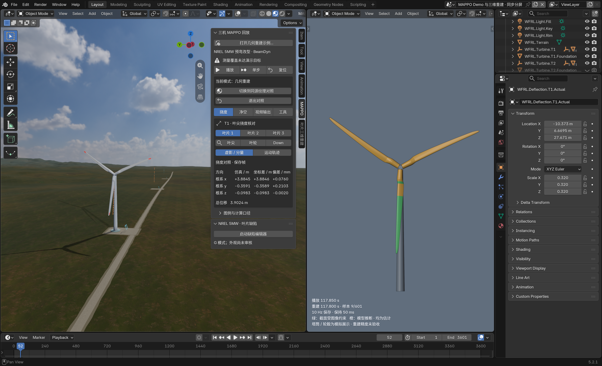
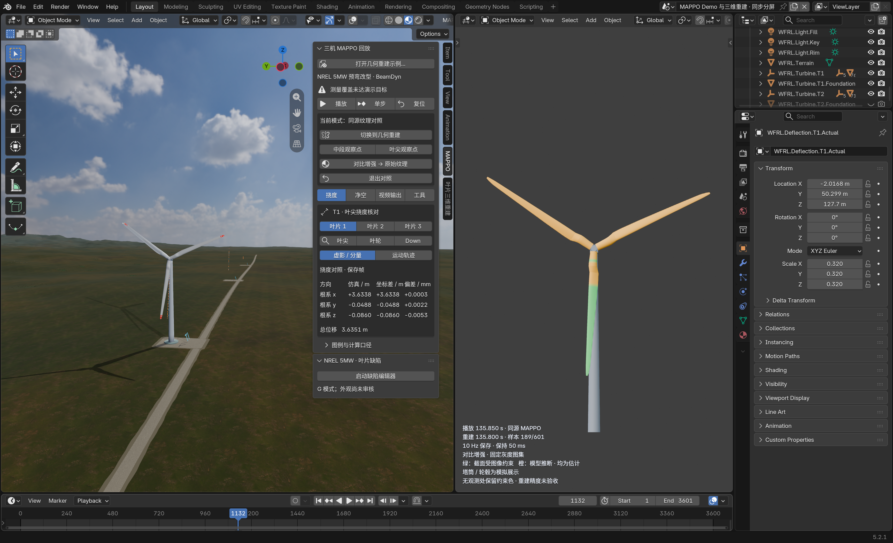
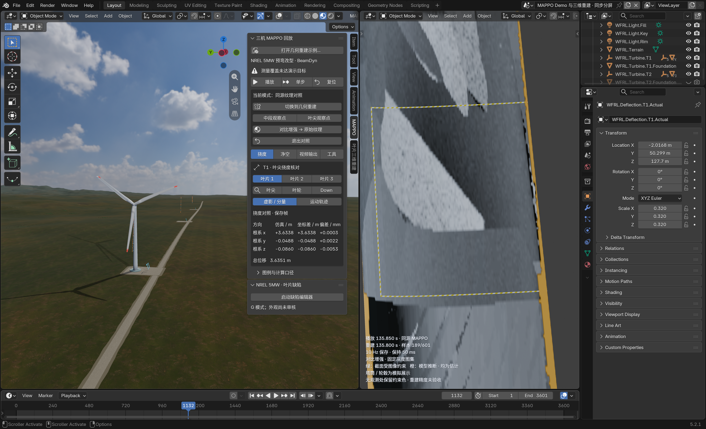

# 2026-10-09 本地重建对照界面验证

本地界面修订已安装到日常 Blender 5.2 扩展目录，重启后的 Blender 5.2.1 LTS 原生窗口验证通过。此构建沿用 0.3.18 版本号，**尚未发布到 GitHub，不能与公开 0.3.18 ZIP 混同**。

- 统一入口为“打开几何重建示例…”，两种模式均显示完整风机。右侧三片叶片为估计重建结果；塔筒、机舱和轮毂为模拟模型展示结构。
- 双向切换保留时间、播放状态及有效视角；共享 60 Hz 时间轴，601 个 10 Hz 保存样本保持六帧。播放、暂停、单帧步进、复位保留。
- 中段／叶尖按钮仅定位一次。原生后侧绕视与缩放，以及真实鼠标滚轮缩放后继续播放，均保留手动视角。
- 每次明确点击原始／增强按钮先恢复两侧整机取景；两种模式保存重开均保留局部视角、时间和显示设置，不触发该取景。
- 重复入口、样本前后跳转、侧栏进度滑块、恢复布局／完整取景／合成示例及跟随字段已从本流程移除；时间、样本、颜色含义及状态移至右视口左下。挠度、净空、视频输出及工具保留。

| 验证 | 结果与记录 |
| --- | --- |
| 核心回归 | [62 passed，104 subtests passed](unit-test-result.json) |
| 日常安装 | [172 个文件与构建包一致](daily-install-inventory.json) |
| 原生窗口完整流程 | [PASS，stage 32](window-a02/reconstruction-workflow-window-validation.json) |
| 真实右视口滚轮后播放 | [PASS，1132 → 1155 帧，视角完全一致](manual-wheel-a02/validation.json) |
| 文件和数据最终核对 | [final-verification.json](final-verification.json) |

本地构建 ZIP SHA-256：`780fdbac191abfc9b4b8489fd6492e9b0b3bf698c0377227ead645fabeed1b3a`。正式源包、固定图集、UV、保存几何和几何示例资产未重生成或改写，未启动求解器。

软件展示与操作验证通过，**重建精度仍为 NOT_ACCEPTED，既有物理精度门槛仍为 FAILED_GATE**。图集条带、接缝和叶尖错位仍保留，增强和放大不代表新增细节、缺陷识别或精度通过。

保留了首次失败记录：[窗口 a01](window-a01/reconstruction-workflow-window-validation.json) 因 10 km 显示原点转换的 float32 导航舍入差失败；后续导航位置比较按该显示坐标的一 ULP（0.0009765625 m）检查，其他视角检查及物理阈值不变。[首次鼠标检查](manual-wheel/validation.json) 因滚轮误落在左视口失败，正确落在右视口后的 a02 通过。[初始代码审查](core-review-initial-check.json) 中发现的问题已修复并通过上述核心回归。

## 原生截图

几何模式整机：

同源纹理模式整机与状态说明：

保存重开后的局部视角：

修改前代码与安装载荷分别保留在 `before/` 和 `installed-before/`；开始时的 Blender 场景另存为 `current-session-preserved.blend`。最终 Blender 窗口保持打开、暂停，便于继续检查。
