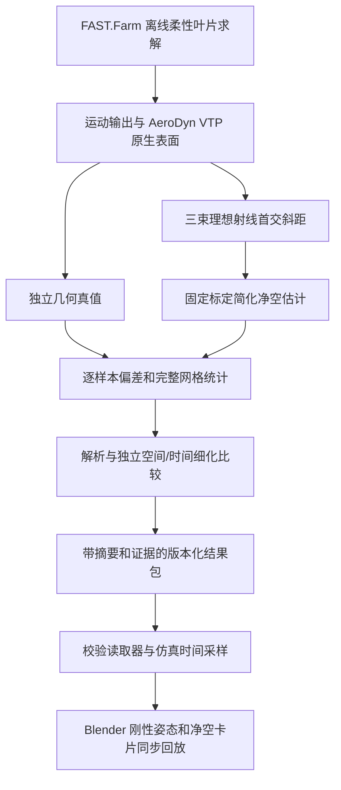

# 激光测距与净空估计算法

本文面向接手离线测距、净空算法和数据生产的开发人员。下文原有章节解释旧 B2 / normal-close 链路；当前双束链路见本页新增说明，两套合同不能混用。Blender 场景、雷达外壳与光束建模见 [前端 README](../../blender_frontend/README.md)。日常操作请看 [当前前端说明](../../前端readme.md#6-挠度净空和遥测)。

## 当前双束链路（0.3.13 安装包与源码）

0.3.13 同步 NREL 前端、雷达算法、处理工具、测试与自包含构建资源源码，保留 S2/S3 净空重建和独立 S1 报警，并加入显式可选 TLS 候选。默认仍为 `hub-axis.v1`，通过“TLS 候选 / S1”加载 `hub-tls.v1`；版本边界见[发布状态](../../docs/blender/发布状态与验证范围.md)。

| 层次 | 实现与责任 |
| --- | --- |
| 后处理 | `scripts/lidar/postprocess_dual_beam.py` 复用已保存的 40 Hz v3 源几何，不启动 FAST.Farm |
| 算法 | `dual_beam.py`：S2/S3 同刻同叶片配对，默认 `hub-axis.v1`、显式可选 `hub-tls.v1`；S1 有效命中独立报警 |
| 校验与回放 | `dual_beam_replay.py`：结果及完整源文件摘要、时间区间和机组一致性，预计算读数、报警和统计历史 |
| 可携带包 | `dual_beam_package.py` / `scripts/lidar/package_dual_beam.py`：复制完整源包到 `source/`，移动后仍可解析 |
| 前端 | `farm_flex.py` / `panels/farm_replay.py`：切换内置旧法、TLS 候选与旧 B2，或加载外部双束包，按同一仿真时钟展示 |

S1/S2/S3 当前安装角为 10°/12°/14°。双束无效不能抑制 S1 报警；没有读数或报警不代表安全。保留缺失和过期语义，不用真值补齐。安装包中的 `assets/dual_beam/` 与 `assets/dual_beam_tls/` 共享 `assets/mappo/` 的原 40 Hz 源几何，不复制两份原始源。软件包可用不代表物理验收：两种方法状态仍为 REVIEW_ONLY / PENDING_ACCEPTANCE，高精度柔性叶尖反演、真实漏测率及保护延迟尚未完成。

2026-09-30 对原 0.3.12 ZIP 内置记录的检查确认：T1/T2/T3 有 33/33/28 次完整过叶，共 94/94 次均含同刻同叶片 S2/S3 配对，400 个有效配对采样；每次至少连续 3 个保存采样点。完整过叶按朝下 ±15° 的完整窗口统计，片段边界截断窗口不计入分母。该结果不表示每帧持续命中，也不要求 S1 在正常片段保持静默；S1 有效叶片首交报警逻辑原样保留。旧 B2/三束覆盖率结论属于另一合同和统计口径。

GW184 0.4.0 是独立刚性三相机与缺陷编辑项目，不使用本页净空算法，雷达更新仅发布到 NREL / WFRL 0.3.13。两个包的入口见[项目首页](../../README.md)。Bridge 后端 MPI/macOS 修复需更新后端源码并重启服务；离线雷达回放不依赖 Bridge。

格式见[双束合同](REPLAY_FORMAT.md#dual-beam-review-v1)，生产与打包入口见[脚本说明](../../scripts/lidar/README.md)。

TLS 研究统一见[候选实施与验证总报告](../../docs/lidar/双束TLS候选实施与验证总报告.md)。同一开发片段的 400 对比较中，旧法 MAE 为 4.268685 m，TLS 为 0.776096 m；第三阶段独立单机 12 m/s、规定 9 rpm 的完整求解，评价 18–26 s 的 40/80 Hz 真实网格，TLS MAE 约为 0.943/0.970 m。两组来源和评分窗口单列，仍为 `PENDING_ACCEPTANCE`。报告中的阶段性“未发布”描述属于研究当时状态；0.3.13 软件交付与安装验证见[本版发布核对](../../docs/blender/0.3.13发布核对.md)，研究数值不能当成现场精度或已验证柔性状态反演。

## 旧 B2 与独立 normal/close 链路

这里的“测距雷达”是 **三束理想激光测距与净空估计的离线仿真实现**。FAST.Farm 先产生柔性叶片运动和表面，计算端分别得到几何真值、理想斜距与简化估计；Blender 校验结果包后同步回放。当前没有实体雷达驱动、现场采集或厂家专有回波处理，Blender 的刚性叶片也不是后端求交几何。

## 1. 从哪里开始接手

从 `physics.py` 的 `Calibration`、`first_hit()`、`simplified_estimate()` 和 `truth_clearance()` 开始，再读 `scripts/lidar/process_physics.py` 如何按统一时钟配对这些结果。接手包校验与回放内核时阅读 `replay.py`、`evidence.py` 和 `REPLAY_FORMAT.md`。各层路径见下一节。

现有结果目录由 [dist/lidar-delivery.json](../../dist/lidar-delivery.json) 指定：`normal` 对应 `normal-v1.1`，`close` 对应 `close-v1.1`。界面把后者显示为“较小净空”，其操作枚举值是 `near_tower`，包内片段 ID 仍为 `close`，不要把三种名称混用。

从仓库根目录启动源码演示：

```sh
/Applications/Blender.app/Contents/MacOS/Blender --factory-startup --python scripts/blender/open_clearance_demo.py
```

该历史入口需要完整工作区、交付清单及两个外部结果包；`evidence/lidar-frontend/clearance-demo.blend` 缺失时会重建场景。安装版则需要先加载匹配风机场景，再配置包目录。外部 normal/close 不随当前扩展提供；回放无需原始 VTP，重新后处理才需要完整原始求解输出。

## 2. 总体架构和模块



| 层 | 源码 | 职责 |
| --- | --- | --- |
| 离线运行 | [`run_physics.py`](../../scripts/lidar/run_physics.py) | 复制原始算例、配置固定转速与风速、运行求解器、保存状态和日志 |
| 几何与公式 | [`physics.py`](physics.py) | 原生表面读取、射线首交、独立真值、固定标定估计、离散碰撞排除 |
| 后处理 | [`process_physics.py`](../../scripts/lidar/process_physics.py) | 运动时间、掠塔网格、三束有效性与逐次测量 |
| 数值比较 | [`validate_physics.py`](../../scripts/lidar/validate_physics.py)、[`sampling.py`](sampling.py) | 解析检查、展向细化、时间细化及含漏测的完整网格比较 |
| 正式发布 | [`publish_physics.py`](../../scripts/lidar/publish_physics.py)、[`evidence.py`](evidence.py) | 验证运行链、证据合同与摘要，生成新包 |
| 播放内核 | [`replay.py`](replay.py) | 严格加载、确定性时间采样、保留时限、累计统计与滞回 |
| Blender 接入 | [`clearance_replay.py`](../../blender_frontend/wfrl_blender/clearance_replay.py) | 场景和机型校验、时间轴映射、运动更新、加载/卸载恢复 |
| 视觉与操作 | [`clearance_visual.py`](../../blender_frontend/wfrl_blender/clearance_visual.py)、[`panels/clearance.py`](../../blender_frontend/wfrl_blender/panels/clearance.py)、[`cameras.py`](../../blender_frontend/wfrl_blender/cameras.py) | 雷达与光束示意、数据卡片、工况操作和观察相机 |
| 打包 | [`build_extension.py`](../../scripts/blender/build_extension.py) | 将标准库读取器与证据校验模块一起放入扩展 `_vendor/lidar` |

前端不读取原始 VTP，也不在 Blender 内重新求解净空。计算端使用 Python 与 NumPy；安装包回放模块只依赖标准库，不要求安装 FAST.Farm。

## 3. 测距、估计和独立真值

### 3.1 物理输入与标定

两个工况均为单机 NREL 5 MW、固定 9 rpm、0° 变桨、无策略 checkpoint；启用叶片柔性，塔筒和平台刚性。正常/较小净空分别为预先选定的 8/12 m/s 有剪切稳态风。运行 36 秒，剔除 0–18 秒启动段，完整保留 18–36 秒，不按误差挑片段。

FAST 全局坐标为 x 下风、y 横风、z 向上。雷达原点 `O=(-2,0,87.6) m`；B1/B2/B3 从竖直向下朝负 x 偏转 `6.45°/8.5°/10.54°`，单位方向为 `d=(-sinθ,0,-cosθ)`。固定理想有效斜距范围为 5–100 m。

### 3.2 测距与简化估计分支

对求解器同一时刻的三片叶片原生三角面进行双面 Möller–Trumbore 射线求交，同时比较刚性圆锥塔筒和地面；取射线 `O+L·d` 的最近正向交点。仅当首交属于当前预期叶片且距离在标定范围内，才是有效测量。遮挡、无命中和超量程保留无效原因。

每束采用同一公开简化公式：

```text
C_est = L · sin(θ) + Y_lidar − R_TIP
Y_lidar = 2 m
R_TIP = 2.67 m（名义叶尖高度 27.2 m 的固定塔半径标定）
```

`L` 是理想首交斜距，`θ` 是相对向下竖直的角度；角度在代码中转弧度后计算。`Y_lidar` 表示朝叶轮方向的主轴水平安装偏距。它不等同于全局 y 坐标；原手册图 2-5 与图 3-26 的 X/Y 命名不同，本实现按物理偏距映射。`simplified_estimate()` 的源码注释标明采用 MolasCL V3.0 第 3.5.3 节简化式；手册核对详见本地 `docs/blender/双束精度与报警集成验证.md`（专项证据与本版软件发布范围分别记录）。本文解释代码中的映射，不声称复现厂商完整算法。

估计器只接收斜距、有效标志和固定标定，不接收实时叶尖位置、形变或真值。三束均存档，但卡片与主统计只使用 B2；B2 无效时不切换其他光束，不用真值填补。

### 3.3 独立真值分支与偏差

最外端 AeroDyn 翼型截面周界坐标的算术均值为叶尖参考点 `P=(x,y,z)`。从原生变形表面独立提取该点，计算它到同高度刚性塔筒圆截面壁的有符号径向净空：

```text
r(z) = 3 + (1.935 − 3) · z / 87.6，0 ≤ z ≤ 87.6
ρ = sqrt(x² + y²)
C_true = ρ − r(z)
Q = (x·r/ρ, y·r/ρ, z)（ρ > 0 时的塔壁参考点）
e = C_est − C_true
```

这两条分支共享同一仿真时刻，计算方式独立。真值不经简化测距公式产生；它是指定叶尖参考点的同高度塔壁距离，不是整片叶片表面的全局最小距离。正偏差表示估计高于真值。B2 误差同时包含直叶片假设、命中截面与叶尖差异、标定和几何离散的影响，不能全部归因于弯曲。

## 4. 包格式、有效性与回放时钟

完整合同见 [`REPLAY_FORMAT.md`](REPLAY_FORMAT.md)。当前 schema 为 `1.0`，新发布证据合同为 `numerical-comparison-v2`。读取器兼容使用旧证据标志的历史 1.0 包；新发布入口则要求新合同，不能仅拿旧标志生成新包。

| 文件 | 内容 |
| --- | --- |
| `manifest.json` | 来源、机型、坐标、标定、算法版本、时间窗口、原始档案引用、数值证据与五个载荷文件的 SHA-256 |
| `motion.json` | 连续展开的方位角、偏航、三叶片变桨、RPM、机舱位置和朝向，覆盖完整片段 |
| `measurements.json` | 预期样本、经过 ID、真值参考点和塔壁点、B1/B2/B3 的斜距、有效性、估计、误差、命中点和原因 |
| `cumulative.json` | 每个测量位置可确定性读取的累计状态与统计 |
| `statistics.json` | 全片段、逐束统计 |
| `report.md` | 工况、几何定义、误差结果与数值比较边界 |
| `validation.json` | 历史 normal/close 交付额外保留的完整数值比较记录；核心合同同时内嵌于 manifest |

加载器检查摘要、版本、来源声明、有限数值、误差一致性，并重新核对累计状态。原始档案路径是溯源引用，播放无需挂载该路径；摘要用于检测损坏，不认证来源真实性。正式发布要求解析、空间/时间比较和离散碰撞证据齐全，缺少时拒绝 READY；`READY` 仅表示通过包合同，`NOT_ASSESSED_NO_TOLERANCE` 明确表示未约定收敛验收容差。

历史 normal/close 交付的预期测量区为叶片方位距离正下方不超过 3°，采用固定 80 Hz 网格。有效率分母包含所有预期样本及漏测。MAE 是有效误差绝对值的均值，最大绝对误差为 `max(|e|)`，P95 为精确 nearest rank `ceil(0.95·n)`，最大正偏差为 `max(0,max(e))`。空分母和空误差集用 null，不伪装为零；完全漏测经过按预先定义的经过 ID 计算。

截至当前回放时刻的统计直接读取累计状态，后退和重播不重复计数。整组三项读数来自同一次 B2 有效测量，离开测量区可暂留；时限为 `min(max_hold_s, 20/abs(rpm)·passage_margin)`，停转仍使用有限 `max_hold_s`。交付配置为 5 秒上限、1.25 倍经过间隔。过期显示等待测量和 `--`，无效数据不会当成零净空。7 m 阈值与 0.1 m 滞回只用于演示。

播放器按加载时固定的时间轴采样率把帧映射到仿真秒数；更改 Blender FPS 只改变目标墙钟播放速度，不重映射已有帧的仿真时刻。运动插值、卡片与统计使用同一时钟；实际墙钟速度取决于机器性能。

### 4.1 读取器接口与返回值

不启动 Blender 也能读取交付包。下面的例子仅校验和读取，不写结果：

```python
import json
from pathlib import Path
from wfrl.lidar.replay import ReplayPackage, ReplayReader

root = Path.cwd()  # 从仓库根目录运行
delivery = json.loads((root / "dist/lidar-delivery.json").read_text())
package = ReplayPackage.load(root / delivery["packages"]["normal"])
reader = ReplayReader(package)
sample = reader.at(reader.start_s + 8.0)
print(sample["time_s"], sample["status"], sample["measurement"])
print(sample["statistics"])
```

`at(t)` 返回 `time_s`、`motion`、`measurement`、`measurement_age_s`、`status` 和 `statistics`。不存在仍在有效保留期内的 B2 读数时，`measurement` 为 `None`，不是三个零值；过期后年龄仍可能保留供诊断。调用方应先检查 `measurement`，不能仅看年龄判断有效性。

读取器对连续展开的转子方位、桨距和 RPM 线性插值，对 yaw 取最短圆周路径；机舱位置等附加字段沿用前一运动记录。测量和统计取目标时刻之前最近的累计状态，不在有效点之间插值补测。

### 4.2 展示端接入约定

Blender 接入层把时间轴转换为原始仿真秒数，再调用 `ReplayReader.at(t)`。接入层还要校验目标机组、片段身份和支持的坐标假设；失败时清空旧读数。结果包与 `.blend` 分开保存，重新打开场景时必须重新校验外部包。

当前生产脚本要求零偏航；前端按固定全局塔原点与刚性塔假设接入，不支持非零机舱 roll/pitch。扩展到运动机舱、任意父级旋转缩放或浮式机组时，需要同步设计物理标定与前端变换。具体场景缓存、帧映射和恢复实现见 [前端 README 第 5 节](../../blender_frontend/README.md#5-mappo-回放相机与后端如何连接)。

### 4.3 与展示端的边界

算法侧提供测量与状态，前端只读取并解释它们。主卡片可以把一个固定时间轴步长内的有效值显示为“新测量”，把更旧但未过期的值显示为“上次有效测量”；这不会改变包内有效样本、过期时刻或累计统计。卡片布局、雷达附件、方向曲线及相机操作的实现见 [Blender 前端 README](../../blender_frontend/README.md)。

## 5. 历史 normal/close 结果和验证边界

下表保留此前文档核对现有包 `statistics.json` 的记录，是既有离线求解结果，不是新运行结果。两段各 8 次经过、71 个预期样本，均没有整次完全漏测。

| 工况 | B2 有效样本 | 有效率 | MAE | 最大绝对误差 |
| --- | ---: | ---: | ---: | ---: |
| 正常测量 | 25/71 | 35.21% | 0.327239 m | 0.410276 m |
| 较小净空 | 33/71 | 46.48% | 0.105805 m | 0.148511 m |

逐束结果与数值细化实数见[正常包报告](../../results/lidar/packages/normal-v1.1/report.md)和[较小净空包报告](../../results/lidar/packages/close-v1.1/report.md)。空间比较保持原时间步，把展向节点从 19 增至 37；时间比较保持 37 节点，将积分时间步由 0.00625 s 减半到 0.003125 s，输出由 80 Hz 增至 160 Hz。完整新网格包含漏测，不能只看匹配时刻的小差异推断全部误差收敛。

碰撞排除覆盖每个保存的 80 Hz 状态下三片叶片的保守分离证书，不是连续时域无碰撞证明。有限两级数值差异不是严格误差上界。没有模拟硬件回波、噪声或厂家专有融合，也没有现场精度、保护功能或训练性能的验收结论。

## 6. 物理结果生产与重新发布

仅调整 Blender 外观、相机或文案时，复用既有物理包，扩展构建步骤见 [前端 README 第 6 节](../../blender_frontend/README.md#6-修改安装与验证)。打包前端不会改变这里的逐样本测量。

**修改物理参数或几何：**需要新物理运行与验证。仅修改标定或估计公式时，可在原始运动/表面输出兼容且完整的前提下复用原运行，重新后处理、验证并发布新结果包；重打 ZIP 本身不会改变结果。准备 Python 3.11+、NumPy、本机 FAST.Farm 和完整 NREL 5 MW 原始算例；版本化交付不包含原始算例及 `results/lidar/raw/`；本地重算前需另行确认这些输入是否齐全。完整可复制命令见[计算脚本 README](../../scripts/lidar/README.md)，流程是：

1. `run_physics.py` 生成基础、空间细化、时间细化三个独立运行，使用新名称保留旧运行。
2. 基础运行用 `process_physics.py` 完整处理；细化对照可用 `--evaluation-only`，该模式不提供完整碰撞证书，不能直接发布客户包。
3. `validate_physics.py` 检查解析与独立时空比较，保留完整网格和原始失败证据。
4. `publish_physics.py` 校验运行配置、退出状态、日志与后处理摘要和证据，发布到新目录；不覆盖旧包。
5. 验证新包可独立读取后，更新交付清单中的目录与摘要，再使用前端回放核对。

宿主机回归、Blender 原生/GUI 操作和物理数值比较是不同验证层，分别记录；文档中的计算结果不能代替本版交互验收。

## 7. 开发验证与排障

### 7.1 宿主机与 Blender 分层检查

从仓库根目录、具备项目依赖的 Python 环境运行：

```sh
PYTHONPATH=blender_frontend:. python3 -m pytest tests/lidar/test_replay.py tests/lidar/test_statistics_edges.py -q
```

Blender 本机可用时，再运行以下原生回归。输出写入新临时目录，避免覆盖原演示文件；示例使用 macOS 安装路径，其他系统替换可执行文件：

```sh
blender_bin="/Applications/Blender.app/Contents/MacOS/Blender"
review_output="$(mktemp -d)"
"$blender_bin" --background --factory-startup --python-exit-code 1 --python blender_frontend/tests/blender/clearance_ux_regression.py
WFRL_TEST_OUTPUT="$review_output/acceptance" "$blender_bin" --background --factory-startup --python-exit-code 1 --python blender_frontend/tests/blender/clearance_acceptance_regression.py
WFRL_TEST_OUTPUT="$review_output/edit-mode" "$blender_bin" --background --factory-startup --python-exit-code 1 --python blender_frontend/tests/blender/clearance_edit_mode_regression.py
```

| 回归入口 | 主要检查 |
| --- | --- |
| `test_replay.py`、`test_statistics_edges.py` | 包读取、有效值保留、过期及统计边界 |
| `clearance_ux_regression.py` | 工况、视角、重播、路径恢复、主卡片与云台折叠 |
| `clearance_acceptance_regression.py` | 无效包清空、固定帧变速、保存重载、相机世界姿态 |
| `clearance_edit_mode_regression.py` | 编辑模式旧文件加载、原网格与选择保留、非当前场景升级 |

编辑模式回归支持 `WFRL_TEST_PACKAGE_ROOT`，值为包含 `wfrl_blender/` 的父目录，可用来检查解包后的实际 ZIP 或安装目录。源码通过不能替代安装版通过；界面可读性、实际镜头效果及鼠标操作还需要单独检查真实窗口。此处列出验证入口，不把文档整理视为重新执行了这些测试。

### 7.2 按故障所在层定位

| 现象 | 优先查看 |
| --- | --- |
| 包无法 READY，提示证据缺失 | `publish_physics.py`、`evidence.py`，以及原运行配置、退出状态和验证文件 |
| `ReplayPackage.load()` 报摘要或累计状态不一致 | 是否修改了载荷却没有重新发布；不要手改摘要或删除校验来强行加载 |
| 包读取正常但 Blender 拒绝 | `clearance_replay.load()` 的机型、片段、转子、标定和机舱姿态检查 |
| 时间在前进但数值不变 | `measurement_age_s` 和 `expires_at_s`；先区分有限保留、等待与播放器未更新 |
| 改完源码但安装版没变化 | 构建 ZIP、安装目录内容与新进程是否一致 |
| 打开旧文件时模型被改名或损坏 | 雷达附件是否重新使用了依赖编辑模式的操作器；运行编辑模式重载回归 |

### 7.3 修改时必须保持的边界

B2 是主卡片和主统计的数据来源；无效时不切换到 B1/B3，也不以真值补齐。显示中的真值、估计与偏差始终来自同一时刻、同一叶片。统计分母保留漏测，暂停、后退和重播不重新累计。缺包或校验失败必须清空旧读数，并给出可排查的原因。

修改 schema、证据合同或统计语义时，同时检查生产端、读取器和扩展内置副本。内置 `_vendor/lidar` 由构建脚本生成，应修改仓库级规范源码，不手改生成副本。仅更换外观、相机或文案，不需要重新求解；改变估计或物理定义则发布新结果目录，并明确与旧包的兼容关系。
