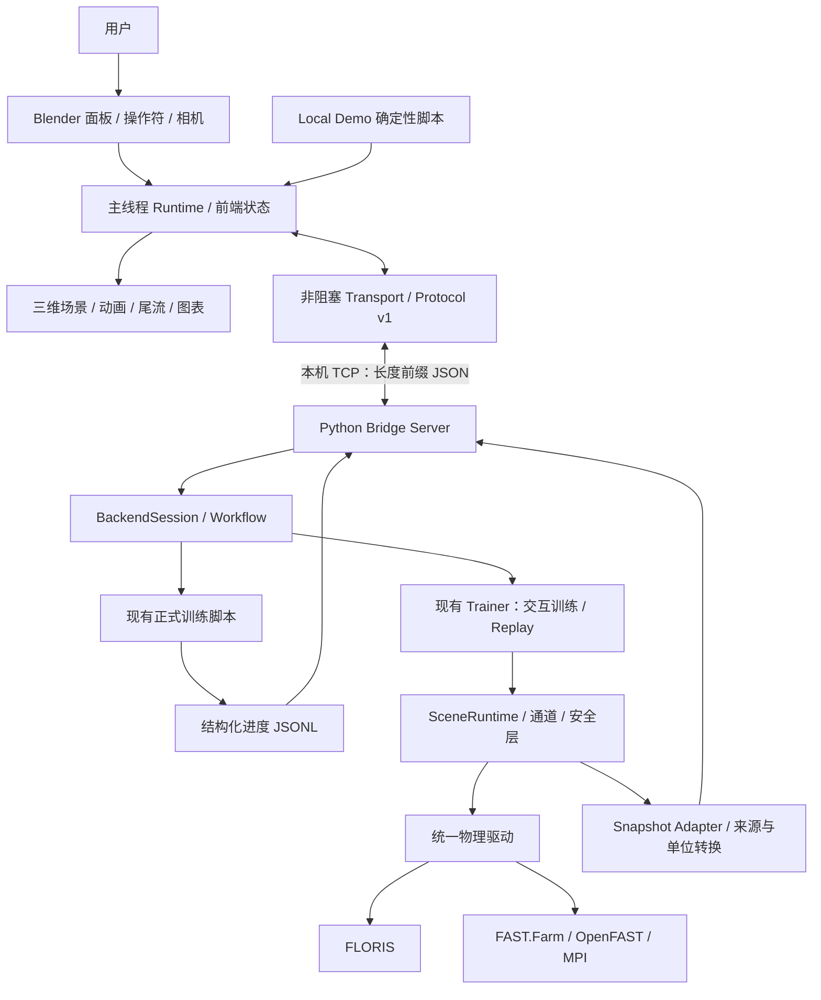

# WFRL 前端说明：当前进度与技术架构

> 更新日期：2026-09-13（0.2.2 雷达及相关展示修订）
> 对应项目：`wind farm RL`  
> 前端扩展：WFRL Blender `0.2.2`
> 本文依据当前工作区源码、安装说明和验收记录整理。历史测试结果与当前源码实现分别说明，不将代码存在等同于完整产品验收。

当前安装与雷达入口见[交付说明](dist/README-lidar.md)及[用户手册第 12 节](docs/blender/用户使用手册.md#12-激光净空雷达第一次照着操作)。以下早期阶段验收表保留历史边界；0.2.2 新增情况见雷达条目及[变更记录](CHANGELOG.md)，本地验收报告和截图并未全部随仓库发布。

## 1. 项目现在是什么形态

WFRL 的前端是一套面向风电场强化学习研究、仿真观察与演示的 **Blender 桌面三维可视化工作台**。用户在 Blender 中查看风机、尾流、传感器示意、遥测和训练状态，通过面板加载场景、启动任务、暂停、回放以及导出展示素材。

当前采用 **Blender Extension + 本地 Python Bridge + 仿真/训练后端** 的分层架构：

- **Blender Extension**：负责三维场景、交互面板、动画、图表、状态展示和截图录制。
- **Python Bridge**：负责本地通信、协议校验、场景配置、运行会话、训练进度和生命周期协调。
- **现有 WFRL 后端**：负责场景语义、策略推理、强化学习、安全约束以及 FLORIS / FAST.Farm 仿真。

项目中还保留了基于 **Qt / PyVista / VTK** 的 Studio 和 RViz 风格界面，用于原有工作流与功能对照。Blender 是目前新增前端工作的主线，旧界面尚未删除。

当前项目没有采用 React、Vue、Next.js 等浏览器前端框架，也没有前端 npm 构建链。这里的“前端”主要指桌面三维交互层。

## 2. 当前进度总览

整体已经具备演示、真实后端连接、训练任务入口和回放工作流，处于 **macOS 部分产品验收完成，继续补齐可见 UI 端到端验收和交付验证** 的阶段。

状态含义：

- **已验证**：存在该边界的测试或原生运行证据。
- **已实现，部分验证**：代码和部分测试存在，仍缺少完整用户路径证据。
- **待验证 / 待完成**：没有足够证据支持完成结论。

| 模块 | 当前进度 | 验证范围与剩余事项 |
| --- | --- | --- |
| Extension 打包与安装 | 当前交付 0.2.2 | 早期 0.2.0 有 macOS Blender 5.2.1 安装、重载记录；0.2.2 隔离 ZIP 与双结果包读取已检查，Windows 未验证 |
| 激光净空离线回放 | 已实现并有专项验证 | 两个 FAST.Farm 修订结果包、播放/暂停/拖动与同步统计；仿真数值不代表现场精度，柔性形变未显示 |
| Local Demo | 已验证 | 固定三台 NREL 5 MW 风机，66 秒确定性演示，支持播放、暂停、单步、停止和复位；数据属于 SYNTH |
| 风机建模与动画 | 已实现并有专项测试 | yaw、独立叶片 pitch、RPM 积分、相机与对象层级已有覆盖；机械细节已进一步补充 |
| 地形与环境展示 | 已实现 | 地表材质、HDR 天空、道路、基座、远山、植被、岩石及天气预设；属于展示层 |
| 尾流与传感器展示 | 已实现并有专项测试 | 支持合成尾流、FAST.Farm DisXY 网格、Lidar 光束和相机视锥；不同来源分别标识 |
| Bridge 协议与连接 | 已验证部分关键路径 | 本地 TCP、握手、序列检查、错误处理与空闲同会话重连有证据；活动任务的可见 UI 重连仍待验证 |
| 场景、通道与运行面板 | 已实现并有注册/状态测试 | YAML 加载校验、通道开关、模式与任务参数已接线；不代表所有原生用户路径均已验收 |
| Interactive FAST.Farm | 后端链路已验证 | macOS 真实 Trainer → Bridge 控制与生命周期已验证，最终 STOPPED 且后端退出；完整安装态 Blender GUI 联调仍需补齐 |
| FLORIS | Bridge 链路已验证 | 有真实 TCP 生命周期记录；原生训练看板展示仍需单独验证 |
| Replay | 后端数值/生命周期已验证 | 已有回放编码与停止清理证据，不据此宣称策略效果或跨次仿真完全一致 |
| Formal Training | 已实现，部分验证 | 启动现有训练脚本，生产/读取结构化 JSONL 进度；实际训练数据到可见看板的完整验收待补 |
| 训练看板 | 已实现，部分验证 | 协议、状态、指标与独立过期逻辑有单元覆盖；原生窗口真实数据显示及过期切换待验证 |
| 历史曲线与 JSON 导出 | 已实现，部分验证 | 有界历史、来源元数据、异步导出与扩展包烟测已具备；可见窗口操作与失败状态证据待补 |
| 相机、多视图、截图 | 已验证部分原生流程 | 单/双/四视图及窗口 PNG 截图已有相关证据；最终展示包装仍待评估 |
| PNG 序列录制 | 最小回归已验证 | 已记录 1 fps、0.1 秒、1 张 PNG 的 COMPLETE 结果；不能推导长时间高帧率稳定性 |
| 暂停 Demo 手动姿态 | 已实现，部分验证 | 仅修改 SYNTH 展示姿态，已有纯 Python 测试；原生 manual_pose 烟测证据尚缺 |
| 最新 Live 展示修复 | 工作区实现中 | 当前有场景、运行时、布局和启动器修改及 `live_presentation_smoke.py`，另有预览图；尚不能当作新一轮完整验收 |
| Windows 交付 | 待验证 | 已提供启动/检查脚本，但没有真实 Windows 安装、MPI、FAST.Farm 与完整 UI 运行证据 |

完整验收口径以 [ACCEPTANCE.md](docs/blender/ACCEPTANCE.md) 为准。主 README 中的强化学习研究阶段与这里的前端工程阶段是两条进度线，不应互相替代。

## 3. 总体架构



### 3.1 进程与依赖隔离

Blender 使用自己的 Python 环境运行扩展；Bridge 使用项目后端 Python 环境。FLORIS、PyTorch、MPI 和 FAST.Farm 等依赖保留在后端环境中。

Local Demo 和激光净空离线回放可以在没有在线后端的情况下运行。雷达通过 `clearance_replay.py` 读取包内运动与测量结果，`clearance_visual.py` 更新示意，`panels/clearance.py` 提供控制与读数；它不经过下面的 Bridge 链路。真实训练和策略回放通过本机 Bridge 调用现有后端，Blender 不直接计算强化学习奖励或执行物理求解。FAST.Farm 路径还涉及 MPI 和仿真子进程。

这种拆分使界面渲染、扩展安装与训练环境相互隔离，避免把大型科学计算依赖安装进 Blender 内置 Python。

### 3.2 线程与刷新机制

- Blender 的 `runtime.py` 是主线程协调器，通过 timer 驱动消息接收、状态更新及画面刷新。
- `transport.py` 使用有界、非阻塞 socket 收发，由 Blender timer 轮询。
- Blender 对象和 `bpy` 数据在主线程更新，后台工作不直接操作 Blender 数据。
- 后端训练、正式任务进程和停止排空由后端负责；停止请求不应长时间占用前端事件循环。
- 历史导出的序列化及文件写入放到后台执行，前端显示完成或失败状态。

动画显示时间、仿真控制步和录制墙钟时间是不同概念。录制不会推进后端，暂停后的动画也不应补算整段暂停时间。

### 3.3 状态管理

前端将连接状态与运行状态分开保存。

| 状态类别 | 状态值 | 含义 |
| --- | --- | --- |
| 连接 | `LOCAL DEMO`、`DISCONNECTED`、`CONNECTED` | 当前是否使用本地演示，以及 Bridge 会话是否已握手确认 |
| 运行 | `READY`、`STARTING`、`RUNNING`、`PAUSED`、`DRAINING`、`STOPPED`、`FAILED` | 后端确认的任务生命周期 |

典型流程是 `READY → STARTING → RUNNING → DRAINING → STOPPED`；支持的模式可在 RUNNING 和 PAUSED 之间切换。

点击按钮只是发出命令，界面需要等待后端确认。断线会使状态变成“未确认”，不代表任务已经停止。FAST.Farm 的停止可能需要完成当前步骤并排空预算，因此 DRAINING 是正常的停止阶段。

## 4. 技术栈与版本

| 层次 | 技术 | 用途 |
| --- | --- | --- |
| 桌面前端宿主 | Blender，manifest 最低 `5.2.0` | 3D View、扩展、渲染、窗口与交互 |
| 已有原生验证环境 | macOS + Blender `5.2.1` | 当前安装及部分展示验收 |
| 扩展开发 | Python + `bpy` | 面板、操作符、属性、对象、材质和动画 |
| 实时/离线渲染 | Eevee / Cycles | 实时 Demo 与离线展示素材 |
| 前后端通信 | Python socket + TCP + UTF-8 JSON | 本机命令、生命周期、遥测、尾流和训练统计 |
| 场景配置 | YAML + `wfrl.scene` | 风机布局、后端、来流、控制量及传感器 |
| 后端 Python | `>=3.11` | 由项目 `pyproject.toml` 声明 |
| 训练可选依赖 | PyTorch `>=2.2,<3`、SB3 `2.3.2`、TensorBoard `>=2.14` | 现有强化学习工作流 |
| 旧 GUI 可选依赖 | PyVista `>=0.43`、pyvistaqt `>=0.11`、qtpy `>=2.4`、PySide6 `>=6.6` | Studio / RViz |
| 打包 | Python `zipfile`、SHA-256 清单 | 生成可复现 Extension ZIP、校验和与文件清单 |

后端物理依赖还需依照 [本地部署说明](docs/setup_local.md) 安装；项目默认 `dependencies=[]`，仅执行 `pip install -e .` 不会自动装齐物理、训练及 GUI 环境。

## 5. 核心目录与职责

以下路径均相对于本项目根目录：

```text
blender_frontend/
├── wfrl_blender/
│   ├── blender_manifest.toml  扩展标识、版本、最低 Blender 版本
│   ├── __init__.py            注册、卸载、Demo 操作与扩展入口
│   ├── preferences.py         项目/Python/MPI/FAST.Farm/端口配置
│   ├── runtime.py             主线程协调、消息分发、运行状态同步
│   ├── state.py               连接与运行状态、操作可用性
│   ├── transport.py           非阻塞本地 TCP 客户端
│   ├── protocol.py            开发态协议加载器；打包时替换为标准协议源码
│   ├── scene_model.py         展示层场景数据模型
│   ├── scene_builder.py       Demo 场景构建
│   ├── live_scene.py          后端快照对应的场景构建与更新
│   ├── turbine_geometry.py    风机与叶片几何
│   ├── mechanical_details.py  机械外观细节
│   ├── animation.py           yaw/pitch/RPM 与动画状态
│   ├── wake.py                尾流数据校验、缓存、网格与代理展示
│   ├── sensors.py             Lidar、相机视锥等几何
│   ├── landscape.py           地形、道路、植被与环境实例
│   ├── atmosphere.py          天空与天气外观预设
│   ├── materials.py           材质构建
│   ├── cameras.py             相机、机组聚焦与构图
│   ├── workspace.py           工作区与视图布局
│   ├── presentation.py        展示控制、截图与录制
│   ├── overlays.py            状态与来源标签
│   ├── charts.py              有界曲线历史与绘图
│   ├── training.py            训练看板状态与指标
│   ├── history.py             历史导出
│   ├── health.py              环境独立检查
│   ├── panels/                场景/连接/运行/通道/遥测/训练/安全/展示面板
│   ├── operators/             连接、工作流、运行与导出操作
│   └── assets/                风机几何与环境资产、来源说明
│   
└── tests/                     纯 Python 测试及 blender/ 原生烟测

wfrl/blender_bridge/
├── __main__.py                Bridge 命令行入口
├── messages.py                唯一标准协议实现
├── server.py                  本地单连接服务、有界收发与握手
├── backend_session.py         任务启动、模式、生命周期与安全停止
├── workflow.py                场景配置覆盖和参数校验
├── snapshot_adapter.py        后端快照转协议记录
├── training_progress.py       正式训练进度读取与校验
├── floris_session.py          FLORIS 会话适配
└── fake_backend.py            协议与开发测试使用的模拟后端

wfrl/studio/                   原 Qt Studio 与复用的 Trainer
wfrl/viz/                      原 PyVista/VTK 可视化与 RViz 界面
wfrl/scene/                    场景 schema 与运行时
wfrl/channels/                 数据通道和传感器
wfrl/safety.py                 后端安全约束
scripts/blender/               构建、启动、检查、渲染与验收脚本
scenes/                       YAML 场景
docs/blender/                 安装、使用、协议、功能对等与验收文档
tests/blender_bridge/          协议和后端桥接测试
dist/                         扩展 ZIP、校验和与文件清单
evidence/                     按阶段保存的测试、运行与展示证据
```

## 6. 四种工作模式

### 6.1 Local Demo

加载固定三风机场景，按照确定性脚本运行一次 66 秒、25 fps 的演示，支持暂停、单显示帧推进、停止和复位。

风机姿态、功率、尾流和脚本事件均属于演示数据。暂停时可以预览指定机组的 yaw/pitch；手动覆盖期间 RPM 保持为零、功率不可用，恢复播放后回到脚本姿态。该功能没有向真实执行器发送指令。

### 6.2 Interactive Training

由 Bridge 包装现有 Trainer 和场景运行时，提供实时快照、通道数据、安全事件及训练统计。用户设置场景、seed、iterations、rollout steps 和 warmup 等参数后启动任务。

暂停与单步取决于后端公布的 capability 和当前状态。单步推进一个完整控制步，不能把 FAST.Farm 的正在执行步骤拆开。

### 6.3 Formal Training

通过 Bridge 启动现有正式训练脚本，复用训练算法和产物路径。结构化进度经 JSONL 读取后，以协商的 `training_stats_v1` 消息送到前端。

正式训练不提供逐步实时 Snapshot，因此不能把看板理解成持续更新的实时物理视口。单步在该模式下禁用。

### 6.4 Replay

加载兼容 checkpoint 做确定性策略推理，不进行 PPO 更新。支持回放步数、warmup 和 seed 配置；checkpoint 不兼容时返回明确错误。

后端回放已存在数值编码和生命周期证据，但这不等于已经证明策略优于零偏航基线。

## 7. 通信协议与数据真实性

### 7.1 本地通信合同

默认地址为 `127.0.0.1:8765`，Bridge 仅允许绑定 loopback IP。协议是自定义长度前缀 TCP JSON，不是 HTTP REST 或 WebSocket。

```text
4 字节大端无符号长度 + 对应长度的 UTF-8 JSON 对象
```

单帧 JSON 长度为 1～1,048,576 字节。协议校验版本、类型、session、单向递增 sequence、字段结构和数值有效性；非法 JSON、非有限数值及错误帧会导致连接失败。

常用命令包括：`scene.load`、`channel.set`、`run.start`、`run.pause`、`run.resume`、`run.step`、`run.stop`、`run.reset`、`session.sync`。

服务端数据包括：`lifecycle`、`snapshot`、`curve`、`wake`、`safety_event`、`error`，以及双方协商后的 `training_stats`。当前尾流传输只接受 JSON，二进制尾流扩展尚未实现。

重连需要重新握手和协商；同会话保留序列语义，未确认命令不会自动重放。本协议没有远程认证或公网部署合同。

### 7.2 来源标签

以当前 `messages.py` 的 wire 校验为准，协议支持以下三个 fidelity 值：

| 标签 | 含义 | 示例 |
| --- | --- | --- |
| `DIRECT` | 当前后端或执行链直接回传 | 具备后端 session 与 channel 来源的遥测 |
| `EXPORTED` | 后端导出产物或按既有合同归类的派生数据 | FAST.Farm DisXY 文件；必须保留来源说明 |
| `SYNTH` | 脚本、代理或装饰性数据 | Local Demo、地形、天气外观、Lidar 示意和合成尾流 |

现有部分用户文档还使用 `DERIVED` 一词描述计算值，但当前 wire 枚举不接受独立的 `DERIVED` 值。集成时必须遵循协议与适配器实际实现，并通过 provenance 说明公式和来源。

每个通道单独携带 `value`、`unit`、`validity`、`error`、`fidelity`、`provenance`、`source_age_seconds`、`stale_after_seconds`。缺失数值使用 null 和原因，不补成零。

### 7.3 有效性与过期

有效性区分 `unsupported`、`waiting`、`valid`、`stale`、`invalid`。数据年龄由源数据年龄加上接收端单调时钟经过时间计算，不能用仿真时间直接减墙钟。

| 数据类型 | 过期阈值 |
| --- | --- |
| 遥测 Snapshot / 曲线 | 2 秒 |
| 尾流 | 5 秒 |
| 安全事件证据 | 10 秒 |
| 训练进度与训练指标 | 30 秒 |

训练阶段进度与指标分别计时。新到达的 sampling/updating 等进度消息不会刷新上一轮指标的年龄。安全事件证据过期后，事件本身仍可保留在历史中。

## 8. 三维展示和数据职责

风机几何与动画使用明确对象层级处理偏航、叶片局部桨距及转子旋转。近期增加了根部法兰、塔筒焊缝、检修门、扶手、机舱接缝与百叶等外观细节；这些属于示意建模，不新增工程测量结论。

地形、道路、维修平台、植被、远山、HDR 天空及 clear/overcast/dusk 预设用于展示。切换外观不会改变后端来流或 reward，画面中的起伏地形也不表示物理后端已经计算了复杂地形效应。

尾流层会复用对象和网格，避免逐帧创建 Blender 对象。已有 600 次更新对象数量稳定等测试，但它们验证的是对象生命周期，不能当作帧率或长时间性能基准。最新植被和机械细节仍需持续运行性能测量。

曲线按稳定 turbine ID 和通道保存，每条遥测序列最多保留 600 个样本。缺失值、单位不兼容或来源变化会断开/抑制绘制，不将不同含义的数据连成连续曲线。

## 9. 安装与启动

### 9.1 构建并安装扩展

在项目根目录执行：

```bash
python scripts/blender/build_extension.py
```

输出包括：

```text
dist/wfrl_blender-0.2.2.zip
dist/wfrl_blender-0.2.2.zip.sha256
dist/wfrl_blender-0.2.2.inventory.json
```

在 Blender 5.2 或更新版本中打开 **Edit → Preferences → Extensions → Install from Disk**，选择 ZIP 并启用 WFRL Blender。进入 3D View 后按 **N**，面板位于 **Item** 标签。

构建时会将标准协议源码复制到扩展内，因此安装后的扩展不依赖源码仓库中的协议加载路径。源码改动后应重新构建安装，不能假设旧 ZIP 自动包含最新工作区修改。

### 9.2 仅运行演示

三风机演示：在扩展中选择 Demo，点击 **Load Demo Scene → Start Demo**，无需 Bridge。雷达演示：在完整仓库中双击 `scripts/blender/打开净空雷达演示.command`，或按[用户手册](docs/blender/用户使用手册.md#12-激光净空雷达第一次照着操作)安装并选择两个修订结果包；不要用 Start Demo 代替雷达片段按钮。

正式后端连接流程使用下面的 Bridge 或平台启动器。

### 9.3 连接真实后端

先按部署文档准备项目后端 Python 环境，在扩展 Preferences 配置绝对路径：Project directory、Backend Python、MPI executable、FAST.Farm executable、Default scene，并确认 Port。

在已配置的后端环境、项目根目录启动：

```bash
python -m wfrl.blender_bridge --host 127.0.0.1 --port 8765
```

随后在 Blender 选择目标模式并点击 **Connect / Reconnect**。通过 **Check Environment** 分别查看 Blender、Python、MPI 和 FAST.Farm 的检查结果；再加载并校验场景，启动任务。

| 场景 | 用途 |
| --- | --- |
| `scenes/turb3_demo.yaml` | 演示与默认启动配置 |
| `scenes/turb3_ctrl3.yaml` | FAST.Farm 三控制量验证场景 |
| `scenes/turb3_stagger.yaml` | 配合兼容 checkpoint 的 Replay 验证 |

### 9.4 平台启动器

扩展需先安装。下列路径是模板，需替换为本机真实可执行文件及场景路径。

macOS：

```bash
scripts/blender/run_wfrl_macos.sh \
  --blender /Applications/Blender.app/Contents/MacOS/Blender \
  --python /absolute/path/to/python \
  --scene /absolute/path/to/scene.yaml
```

Windows PowerShell：

```powershell
scripts\blender\run_wfrl_windows.ps1 --blender C:\path\to\blender.exe --python C:\path\to\python.exe --scene C:\path\to\scene.yaml
```

FAST.Farm 场景还需配置 `--mpi` 和 `--fastfarm`。启动器负责启动自己拥有的 Bridge、等待监听、打开 Blender 并配置连接，结束时清理自己启动的 Bridge；端口占用时拒绝附着到未知服务。

Windows 命令代表当前交付脚本接口，尚无真实 Windows 平台验收结论。

## 10. 输出与测试

### 10.1 用户输出

- **Save Screenshot**：保存当前可见 Blender 窗口 PNG，包含界面来源标签。
- **Record PNG Sequence**：按墙钟录制窗口，支持 1～30 fps、0.1～3600 秒；输出编号 PNG 和含实际时间信息的 `manifest.json`，可用 Esc 取消。
- **Export Bounded History**：在 Live Telemetry 中导出当前运行的有界 JSON 历史，保留 schema、运行标识、序列与来源信息；显示 COMPLETE 或 FAILED。

界面录制直接产出 PNG 序列；离线渲染脚本另有 MP4 预览流程。已有 Part 5 动画预览为 960×540、12 fps、3 秒，不是长时实时录制性能证据。

### 10.2 测试分层

| 测试层 | 主要位置 | 能说明什么 |
| --- | --- | --- |
| 纯 Python 单元/合同测试 | `blender_frontend/tests/test_*.py` | 状态、协议、动画数学、图表、打包、导出等逻辑 |
| Bridge 测试 | `tests/blender_bridge/` | 协议、工作流、后端适配、训练进度 |
| Blender 原生烟测 | `blender_frontend/tests/blender/` | 注册、对象、场景、操作符与部分 UI/渲染行为 |
| 真实后端运行证据 | `evidence/part6/`、`evidence/part7/` | Replay、FLORIS、FAST.Farm 数值和生命周期的具体边界 |
| 原生可见窗口验收 | `docs/blender/ACCEPTANCE.md` 对应产物 | 真实用户操作、数据展示、截图录制和错误状态 |

在具备依赖的项目 Python 环境中，可运行回归测试：

```bash
python -m pytest blender_frontend/tests tests/blender_bridge
```

Blender 专用烟测需要使用 Blender 执行，不能用普通 Python 测试替代。需要窗口的截图、录制及可见 UI 验收还必须在原生可见窗口中运行。

现有 `evidence/part7/baseline-tests.log` 记录的阶段性基线为 **170 passed, 2 skipped，4.42 秒**。这是已保存的历史范围结果，不是本文编写时重新执行的测试，也不保证覆盖当前所有未提交的展示修复。

## 11. 当前限制与下一步

### 2026-09-09 验收更新

本轮 macOS Blender 5.2.1 原生验收已覆盖 Interactive、Formal 看板、暂停、单步、活动任务重连、快速停止、历史 JSON 导出及导出失败提示。证据位于 `evidence/frontend_completion/`；报告显示 `passed: true`，Python 回归为 **202 passed**。地形查询改为一次 BVH 快照复用，场景构建由约 44 秒降至约 4 秒，Blender 地形采样烟测误差为 0。

当前版本可以作为 macOS 前端演示交付。Windows 目标平台、Extension/App Template 品牌包装及真实执行器 API 仍不在本轮验收范围。

1. **补齐训练看板端到端验收**：记录真实 Interactive / Formal 训练数据到 Blender 可见指标的过程，检查 run identity、来源、缺失字段和独立过期状态。
2. **补齐导出用户路径**：通过原生可见窗口执行 JSON 导出，检查有界/截断信息、同一步不同阶段、来源和写入失败提示。
3. **补齐手动姿态原生烟测**：证明只在暂停的 Local Demo 生效，Resume 后恢复脚本，不产生真实控制命令。
4. **验证最新 Live 展示修改**：将当前源码修改重新打包，验证真实场景中的环境、尾流示意、布局及暂停行为，保存对应运行记录。
5. **测量持续展示性能**：覆盖较长时间动画、录制和新增植被/机械模型的负载；尚无足够证据给出稳定实时帧率承诺。
6. **完成目标平台交付验证**：在后续恢复 Windows 验证时检查同一扩展包、Python、MPI、FAST.Farm、进程清理和全部用户流程；macOS 目标分发二进制及硬件组合也需明确验证。
7. **完成最终展示与品牌评估**：Extension / App Template 展示和最终品牌评估当前处于推迟状态，不能宣称最终品牌发行已经完成。

真实人工 yaw/pitch/torque 执行器 API、二进制尾流协议、远程多用户服务以及地形耦合物理不属于当前已经完成的前端能力。后续若扩展，应先明确后端合同与验收条件。

## 12. 继续开发时从哪里开始

| 修改目标 | 优先入口 |
| --- | --- |
| 面板与按钮 | `panels/`、`operators/`、`__init__.py` |
| 操作可用性、模式与连接状态 | `state.py`、`runtime.py`、`transport.py` |
| 场景配置和控制命令 | `operators/workflow.py`、Bridge `workflow.py`、`backend_session.py` |
| 新增协议字段/消息 | Bridge `messages.py`，同步适配器、前端、协议文档和合同测试，再重新打包 |
| 训练指标 | Bridge `training_progress.py`、前端 `training.py`、`panels/training.py` |
| 风机、尾流和环境 | `turbine_geometry.py`、`live_scene.py`、`wake.py`、`landscape.py` |
| 图表和导出 | `charts.py`、`history.py`、`operators/history_export.py` |
| 安装与启动 | `scripts/blender/build_extension.py`、`wfrl_launcher.py`、平台 wrappers |

开发时维持以下边界：物理与策略逻辑放在后端；Blender 主线程更新对象；字段保留单位、来源和有效性；暂停、断线与停止分别处理；高频展示使用有界历史和复用几何。

## 13. 相关文档

- [激光净空雷达说明](docs/blender/激光净空雷达使用说明.md)：离线操作、数据来源与验证边界。
- [雷达交付说明](dist/README-lidar.md)：0.2.2 安装包、两个修订结果包及校验方法。

- [项目总 README](README.md)：研究目标、双后端与算法进度。
- [安装说明](docs/blender/INSTALL.md)：扩展安装、环境和平台启动器。
- [用户指南](docs/blender/USER_GUIDE.md)：四种模式、视图、录制与导出。
- [验收矩阵](docs/blender/ACCEPTANCE.md)：当前通过范围及缺失证据。
- [Protocol v1](docs/blender/protocol-v1.md)：帧格式、状态、来源、过期和训练统计扩展。
- [功能对等基线](docs/blender/feature-parity.md)：旧 Studio/RViz 向 Blender 迁移的功能合同。
- [Part 5 展示层记录](docs/blender/PART5.md)：尾流、环境、建模和渲染成果。
- [故障排查](docs/blender/TROUBLESHOOTING.md)：运行问题与处理方式。
- [环境资产来源](blender_frontend/wfrl_blender/assets/landscape/SOURCES.md)：第三方展示资产说明。

### 机舱云台相机（T1 / T2 / T3）

在 3D 视图按 **N**，打开右侧 **Item** 标签中的 **Gimbal Camera 云台相机** 面板（旧版为 Camera；专用雷达入口使用演示文件当前标签）：

- 选择 **T1 / T2 / T3**，再点击 **Camera Mode / 相机模式**。
- 按住鼠标左键拖动画面可转向，滚轮调整视野大小，**Esc** 退出控制并保留当前画面。
- 画面右上方的圆形摇杆：按住拖动，偏离中心越远转得越快，松手停止；侧栏可调转速。
- **Down** 垂直向下观察叶片，**Front / Back** 朝机舱前方 / 后方看，**Reset** 恢复俯视及 75° 视野。
- 控制期间仍可点击侧栏切换机组。每台机组独立记住方向和视野；相机固定挂载于机舱，跟随偏航，不自由平移。

相机按需创建，因此既支持现有写实 `.blend`，也支持 FAST.Farm 连接后创建的实时场景。实时模式先点击 **Start**，收到场景快照后相机按钮才可用。双视图中的相机切换只影响操作所在的视图。

正式启动继续使用 `scripts/blender/wfrl_launcher.py launch`；它加载的是 Blender 已安装扩展。修改源码后，需要重新运行 `scripts/blender/build_extension.py` 并更新已安装扩展。写实场景的源码预览入口为 `scripts/blender/open_gimbal.py`，加载 `evidence/part5_realistic.blend`。
